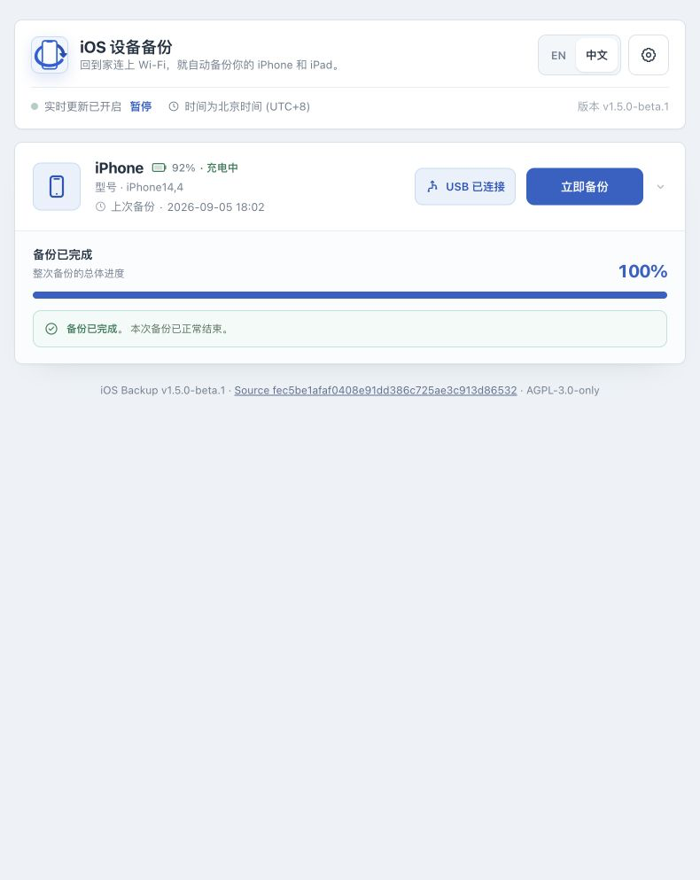

# iOS Backup

[English](README.md)

iOS Backup 是一个本地优先、面向单管理员的 iPhone/iPad 备份 Web 应用，用于把设备备份到 Linux 主机或 NAS。它在特权容器中封装 libimobiledevice、usbmuxd2 和 netmuxd，提供 USB 发现、定时备份、只读备份查看和可选通知。

> **当前版本：**`v1.5.2` 增加备份无活动超时保护，准确展示会话阶段和最后活动时间。Wi-Fi 与加密仍属于预览功能，支持范围见下文。



上图来自 Raspberry Pi ARM64 测试实例，已完成一次 USB 备份并核对磁盘完成标记。已有加密备份的解密读取和整机恢复仍未验证。安装、设备接入、进度及成功终态的真实截图见[图文快速开始](docs/QUICKSTART.zh-CN.md)。

## 功能状态

- **核心（Core）：**USB 发现与配对、手动与定时备份、只读备份信息和文件清单查看。
- **预览（Preview）：**Wi-Fi 备份、备份加密开关和改密；不同设备与网络环境仍可能出现兼容问题。
- **实验（Experimental，默认关闭）：**整机恢复、本地解包、本地备份删除。启用前请阅读[功能状态](docs/FEATURE_STATUS.zh-CN.md)。

本地 Web UI 没有遥测或远程前端资源。只有管理员主动配置 Telegram、SMTP、企业微信、Bark 或 Webhook 后，通知才会产生出站请求。内建认证只面向单管理员，不是多用户权限系统。

## 官方平台与安全警告

官方分发形式是 Linux 容器，支持 `linux/amd64` 和 `linux/arm64`。不承诺在 Windows 或 macOS 上直接运行真机功能。Go 模块本身只使用标准库，但运行时仍依赖镜像内的 libimobiledevice/netmuxd 工具链，不能理解成“整个应用零依赖”。

容器必须使用 `--privileged`、`--network host`、`/dev/bus/usb:/dev/bus/usb` 和 `/run/udev:/run/udev:ro`。**特权模式等同授予宿主机级权限，只能在可信主机和可信网络运行。不要暴露到公网。**即使启用了认证，也仍需要防火墙、VPN 或带认证的 HTTPS 反向代理。

## 快速开始

需要：安装 Docker Engine 和 Docker Compose 的 Linux 主机、一台已解锁的 iPhone/iPad，以及空间足够的数据目录。请按完整设备备份预留空间。

```bash
git clone https://github.com/razeencheng/iosbackup.git
cd iosbackup
umask 077
mkdir -p data/backups data/configs data/lockdown
openssl rand -base64 24 > data/configs/admin_password
printf 'IOSBK_IMAGE=%s\nIOSBK_SECRET_KEY=%s\n' \
  'ghcr.io/razeencheng/iosbackup:v1.5.2' \
  "$(openssl rand -base64 32)" > .env
docker compose pull
docker compose up -d
curl -fsS http://127.0.0.1:9000/healthz
```

由于创建目录前已设置 `umask 077`，三个数据目录将以仅所有者可访问的权限创建；复制或恢复目录时也应保持该权限。

在可信网络中打开 `http://<Linux主机>:9000/`，使用 `data/configs/admin_password` 中的密码登录。首次备份前，用 USB 连接并解锁设备，在设备上点击“信任”，再回到界面刷新并完成配对。启用定时任务前，请在非关键设备上完成一次 USB 备份并确认结果。

Compose 部署等价使用 `--privileged` 和 `--network host`，挂载 `/dev/bus/usb:/dev/bus/usb` 与 `/run/udev:/run/udev:ro`，并持久化三类状态：

| 容器路径 | 用途 | 升级前备份 |
|---|---|---|
| `/backups` | iOS 备份数据 | 是 |
| `/configs` | 设置、认证、CSRF 状态和加密秘密 | 是 |
| `/var/lib/lockdown` | 设备配对记录 | 是 |

请保护 `.env`、管理员密码和以上三个卷。保存过通知秘密或备份密码后，必须保持 `IOSBK_SECRET_KEY` 不变；丢失或更换会导致已保存秘密无法读取。

完整步骤见[快速开始](docs/QUICKSTART.zh-CN.md)。

## 升级与回滚

先备份 `data/backups`、`data/configs`、`data/lockdown` 和 `.env`。把 `.env` 中的 `IOSBK_IMAGE` 改成明确版本标签，然后执行 `docker compose pull` 与 `docker compose up -d`。检查 `/healthz`、`/api/version`、日志和配对状态，并在非关键设备上重新验证一次完整 USB 备份。

需要回滚时，把 `IOSBK_IMAGE` 改回上一明确标签，再次执行 `docker compose up -d`。不要盲目回滚持久化数据；只有发布说明确认磁盘格式不兼容时，才恢复卷快照。不要用 `:latest` 替代已审核标签。

完整的升级、回滚、卷备份和日志流程见[操作手册](docs/OPERATIONS.zh-CN.md)。

## 排错

- **找不到设备：**解锁设备，重插 USB，点击“信任”，检查 USB 和 udev 挂载后再刷新。
- **`mobilebackup2 (-4)` 或 Wi-Fi 中断：**让设备重新连接，优先改用 USB 重试；Wi-Fi 仍是预览能力。
- **设备锁定/密码错误：**配对和备份开始阶段保持设备解锁。
- **空间不足/只读/权限错误：**检查 `data/backups`、`data/configs`、`data/lockdown` 的可用空间和宿主机权限。
- **容器启动但界面不可用：**查看 `docker compose logs --tail=200 iosbackup`，并运行 `curl -fsS http://127.0.0.1:9000/healthz`。

详细处理见[操作手册](docs/OPERATIONS.zh-CN.md)。

## 文档

- [快速开始](docs/QUICKSTART.zh-CN.md)
- [操作手册](docs/OPERATIONS.zh-CN.md)
- [功能状态](docs/FEATURE_STATUS.zh-CN.md)
- [通知配置指南](docs/NOTIFICATION_README.md)
- [Webhook 推送指南](docs/WEBHOOK_GUIDE.md)
- [隐私](docs/PRIVACY.md)
- [安全策略](SECURITY.md)
- [支持范围](SUPPORT.md)
- [版本记录](CHANGELOG.md)

## 版本历史

- **v1.5.2：**独立于设备在线状态检测备份停滞，失败时保留最后成功备份时间，区分授权等待、数据传输和手机处理阶段。详见[版本记录](CHANGELOG.md)。
- **v1.5.1：**后台自动恢复曾注册的 Wi-Fi 设备，支持不填手动 IP、由 mDNS 发现的设备；测试 IP 仅在确认设备注册后提示成功。详见[版本记录](CHANGELOG.md)。

## 开发与贡献

源码结构为 `cmd/iosbackup` → `internal/app` → 叶子包。本地从源码构建后，运行时仍需外部设备工具：

```bash
go test -count=1 ./...
go vet ./...
CGO_ENABLED=0 go build -trimpath -o iosbackup ./cmd/iosbackup
```

贡献采用 inbound = outbound 的 `AGPL-3.0-only`，不要求 CLA、DCO 或 `Signed-off-by`。详见 [CONTRIBUTING.md](CONTRIBUTING.md)。

## 许可证与商标

项目源码采用 [GNU AGPL v3.0 only](LICENSE)，SPDX 标识为 `AGPL-3.0-only`。容器组件继续适用各自许可证，详见[许可证说明](docs/LICENSING.md)与[第三方声明](THIRD_PARTY_NOTICES.md)。

Copyright (C) 2025-2026 Razeen Cheng。本项目与 Apple Inc. 无隶属、赞助或背书关系，详见 [TRADEMARKS.md](TRADEMARKS.md)。
