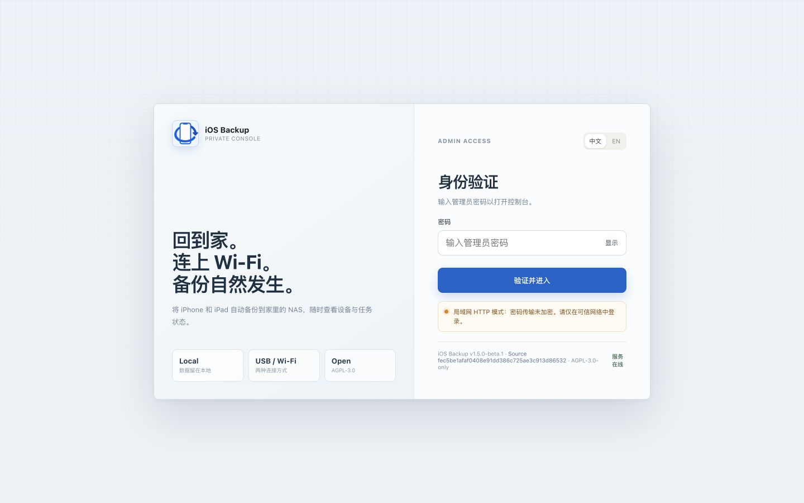
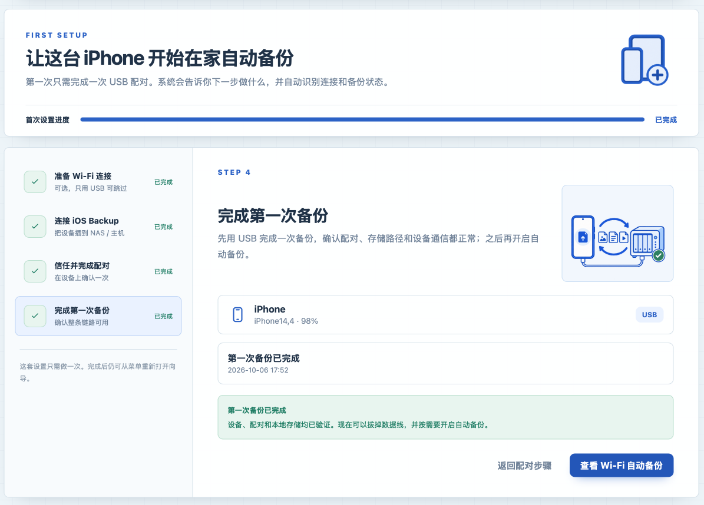
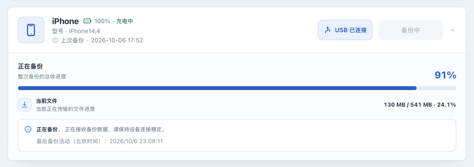

# Quick start

[简体中文](QUICKSTART.zh-CN.md) · [Back to README](../README.md)

This page takes you through **a fresh Linux Docker Compose installation, sign-in, and your first USB backup** . Use the separate [Synology guide](manual/synology.md) for DSM and [upgrade and rollback](manual/upgrade.md) for an existing instance. Advanced setup and troubleshooting live in the [installation guide](manual/installation.md).

## 1. Download the Compose file

Prepare a Linux host with Docker Engine and the Compose plugin, an iPhone/iPad whose passcode you know, and a USB data cable, with space for a complete device backup. Image targets are `linux/amd64` and `linux/arm64`; native device operation on Windows or macOS is not promised.

Save the [compose.yaml](../compose.yaml) that accompanies your selected image in a new deployment directory, such as `$HOME/iosbackup-deploy`.

> Compose uses `--privileged`, `--network host`, `/dev/bus/usb:/dev/bus/usb`, and `/run/udev:/run/udev:ro`, and persists `/backups`, `/configs`, and `/var/lib/lockdown`. Privileged mode grants host-level access. We recommend using only trusted images, restricting access sources, and keeping the Web UI off the public internet.

## 2. Start and sign in

Run in the **deployment directory on the Linux host** :

```bash
cd "$HOME/iosbackup-deploy"
docker compose up -d
docker compose logs iosbackup
```

The first start creates the administrator password and encryption master key in persistent `data/configs`; restarts and upgrades reuse them. Only the newly generated administrator password appears in the first-start log; the master key is never logged. Do not share the first-start log publicly.

Open your protected access address in a browser. The default is `http://<Linux-host>:9000/`. Enter the administrator password from the log, click **Verify and continue** , open the first-use wizard, and select **Skip for now, use USB only** .



If the first-start log is unavailable, read the default password using `sudo cat data/configs/admin_password` in a **protected terminal on the host** . See the [installation guide](manual/installation.md) for custom passwords or startup failures. Cold startup may take tens of seconds; `/healthz` only proves HTTP responsiveness, not pairing or backup success.

## 3. Pair and complete the first USB backup

1. Connect the phone by USB to the Linux host running the service. If **Trust This Computer** appears, unlock the phone and tap **Trust** , following any further prompts.
2. Refresh devices in the Web UI and check pairing as prompted (pairing is usually complete after you tap **Trust** on the phone). Wait for the wizard to reach **Complete your first backup** and confirm the connection is **USB** .
3. We recommend comparing the phone's used capacity with free space in `data/backups` on the host, allowing headroom. The wizard's “Ready for the first backup” message confirms device and pairing readiness; it does not check available disk space. We recommend that you complete a USB backup first.



4. Select **Back up now** and keep the cable connected. If the backup wakes the phone and displays a passcode screen, enter the device passcode as prompted.
5. Wait for the backup to progress.



6. Verify the completed status, completion time, and [read-only backup information](manual/inspection.md). On failure, retain data and follow the [USB backup guide](manual/usb-backup.md) before retrying.


A device with existing backup encryption still produces encrypted backups. Retain its original backup password; successful backup does not establish that this instance has saved it. See [encryption](manual/encryption.md) for encrypted-manifest access. Backup success also does not establish device-restore success.

## Next steps

After your first successful USB backup, continue with [Enable and validate Wi-Fi backup](manual/wifi.md). Follow the guide to enable the device's Wi-Fi connection option using your computer, then return to the Web UI, confirm that the device shows **Wi-Fi connected** , and complete a Wi-Fi backup.

Then continue as needed:

- Configure [scheduled backups](manual/scheduling.md) and [notifications](manual/notifications.md) for routine backups and their results.
- [View backup information and file lists](manual/inspection.md), or learn about [backup encryption and passwords](manual/encryption.md).
- If something goes wrong, consult [Troubleshooting](manual/troubleshooting.md) and [States, progress, and errors](manual/states.md).
- Before upgrading or migrating, follow [Instance backup and recovery](manual/instance-recovery.md) to protect all three persistent volumes, including the password and `secret_key` in `data/configs`, plus any additional configuration and external keys you use. Then read [Upgrade and rollback](manual/upgrade.md).

Find more tasks in the [operations manual](OPERATIONS.md), and check [Feature status](FEATURE_STATUS.md) for each capability's support boundaries.
