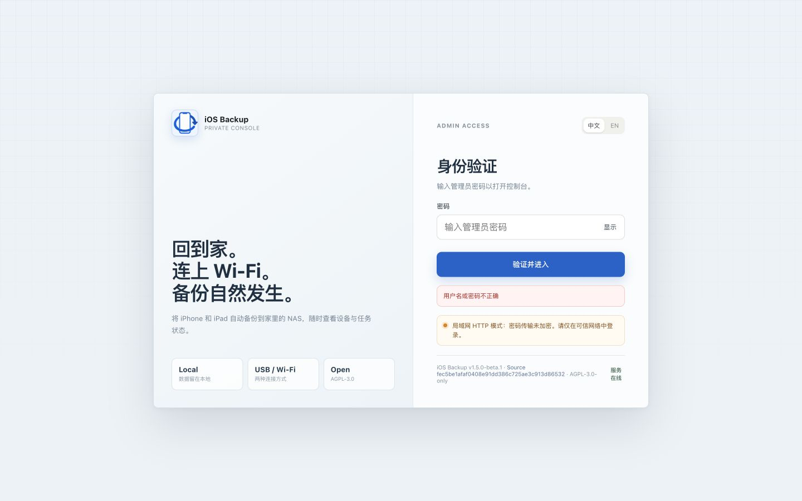
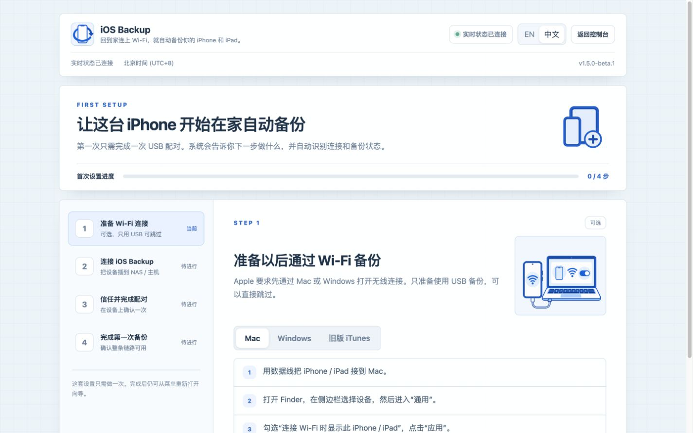
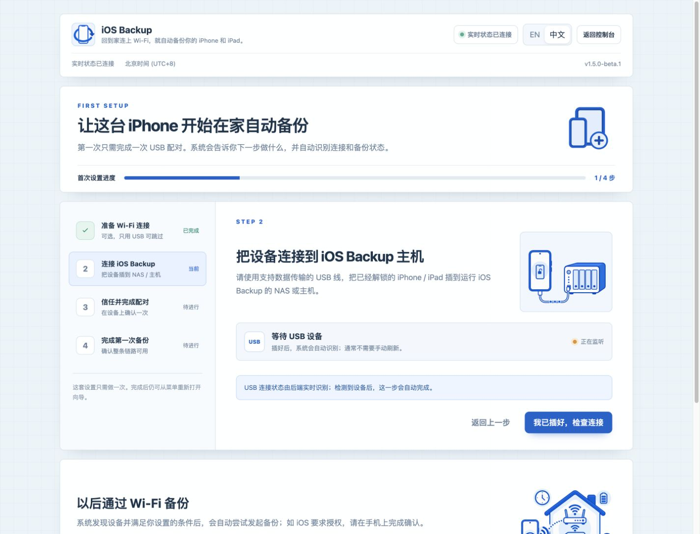

# Quick start

[简体中文](QUICKSTART.zh-CN.md) · [Back to README](../README.md)

This guide starts the official Docker image on a trusted Linux host. The same image supports `linux/amd64` and `linux/arm64`. Windows and macOS native device operation is not supported or promised.

The screenshots below show a real Beta candidate running on a Raspberry Pi ARM64 host, with the UI set to Chinese. They cover login, device setup, backup progress, and one successful USB backup. Task success does not establish verified decryption or device restore. See the [image inventory](images/tutorial/README.md) for the source and verification scope.

> The container uses `--privileged` and `--network host`. Privileged mode grants host-level access. Do not run unreviewed images, and do not expose the Web UI to the public Internet.

## 1. Prepare the host

Install Docker Engine, the Docker Compose plugin, Git, and OpenSSL. Choose a local filesystem and reserve enough space for a complete device backup.

```bash
git clone https://github.com/razeencheng/iosbackup.git
cd iosbackup
umask 077
mkdir -p data/backups data/configs data/lockdown
openssl rand -base64 24 > data/configs/admin_password
printf 'IOSBK_IMAGE=%s\nIOSBK_SECRET_KEY=%s\n' \
  'ghcr.io/razeencheng/iosbackup:v1.5.1' \
  "$(openssl rand -base64 32)" > .env
chmod 600 .env data/configs/admin_password
```

Because `umask 077` is set first, the three data directories are created with owner-only permissions. Keep those permissions when copying or restoring them. Do not rotate `IOSBK_SECRET_KEY` after storing notification secrets or backup passwords. Store an offline copy of `.env` and the admin password.

## 2. Review the required access

The supplied [compose.yaml](../compose.yaml) configures the equivalents of:

- `--privileged`
- `--network host`
- `/dev/bus/usb:/dev/bus/usb`
- `/run/udev:/run/udev:ro`
- persistent `/backups`, `/configs`, and `/var/lib/lockdown` volumes

Use only a trusted host and trusted LAN/VPN. The default Compose port is `9000`. Put any remote access behind an authenticated HTTPS reverse proxy and network ACL; do not publish the service directly to the Internet.

## 3. Start and verify

```bash
docker compose pull
docker compose up -d
docker compose ps
curl -fsS http://127.0.0.1:9000/healthz
curl -u "iosbackup:$(cat data/configs/admin_password)" \
  http://127.0.0.1:9000/api/version
```

Open `http://<linux-host>:9000/` and enter the password from `data/configs/admin_password`. HTTP does not encrypt the password in transit, so use it only on a trusted network; prefer HTTPS for access beyond the host.


Choose **Verify and enter** (验证并进入). An incorrect-credentials message means you should check the password file and the `/configs` mount for this instance. Keep passwords out of issues and screenshots.



## 4. Choose whether to prepare Wi-Fi

Open the onboarding wizard. For USB only, choose **Skip for now, use USB** (暂时跳过，只用 USB). To prepare future Wi-Fi access, follow the Finder, Apple Devices, or legacy iTunes instructions to enable wireless connectivity, then choose **I have completed this** (我已完成). This step requires the computer; the NAS cannot verify it. Skipping it does not prevent USB backups.



Wi-Fi remains Preview. Keep using USB for the first acceptance check to verify pairing, storage, and a complete backup.

## 5. Pair the first device over USB

1. Unlock the iPhone or iPad and keep its screen awake.
2. Connect it to the Linux host by USB.
3. Tap **Trust** on the device and enter its passcode when asked.
4. In iOS Backup, refresh the device list and start pairing if prompted.
5. Wait for pairing to complete and the wizard to reach the first-backup step.



If the Trust prompt does not appear, reconnect the cable, unlock the device, and check the USB/udev mounts. Pairing records persist in `/var/lib/lockdown`; losing that volume requires pairing again.

If the page reports a locked device, enter its passcode on the phone and retry pairing. A previously trusted device may complete this step immediately. Two USB mux services or backup containers using host networking can compete for the same listener. Stop a conflicting old instance before testing a new one, then restore the original service when testing ends.

## 6. Complete the first USB backup

Complete one USB backup on a non-critical device and verify the result before enabling a schedule. Confirm that the device shows **USB** and reserve enough space for a complete device backup. There is no test mode that backs up only a few sample files.

Run `df -h ./data/backups` on the host to check free space, and review used capacity under **Settings > General > iPhone Storage** on the phone. Backup size is not necessarily equal to used device storage. When an accurate estimate is unavailable, reserve the used capacity plus a margin and leave free space for the host system. Use a larger disk or a device with less data when space is insufficient. **Ready for the first backup** confirms device and pairing readiness, not sufficient disk space.


1. Choose **Back up now** (立即备份) and keep the cable connected.
2. Enter the passcode or approve the backup on the phone if iOS asks.
3. Wait for an explicit success or failure result. A progress value of 100%, or an online device, does not alone establish success.
4. Return to the console and check the latest backup result, timestamp, and read-only backup information. On failure, preserve existing data and follow the [Operations manual](OPERATIONS.md) before retrying.

During a backup, the console shows overall progress separately from the current file transfer. The file indicator starts again for each new file; this does not mean the whole backup has restarted.


After a successful task, the console shows **Backup completed**, a completion timestamp, and an available backup button.


If backup encryption was already enabled in Finder or Apple Devices, backups made by a new deployment remain encrypted. A successful backup does not mean that this instance has the correct saved backup password. Information or file-list requests can fail with `MBErrorDomain/207` when the password is missing. Keep the original backup encryption password; it is separate from the device passcode, Web UI password, and `IOSBK_SECRET_KEY`. The successful run shown here had its on-disk completion marker checked, but manifest decryption was not verified.

A complete backup also does not establish a tested full-device restore; restore remains an Experimental capability that is off by default.

## 7. Configure backups

Use the device card to choose a backup window, interval, battery threshold, charging requirement, and a path under `/backups`. Leave Wi-Fi, encryption, and experimental operations off until the USB path is verified.

The following container paths are state, not disposable cache:

| Path | Contents |
|---|---|
| `/backups` | backup data and optional unpack output |
| `/configs` | backup settings, auth/CSRF files, encrypted notification/password secrets |
| `/var/lib/lockdown` | device pairing records |

Back up all three volumes and `.env` before every upgrade. Continue with the [Operations manual](OPERATIONS.md) and check [Feature status](FEATURE_STATUS.md) before enabling Preview or Experimental capabilities.
