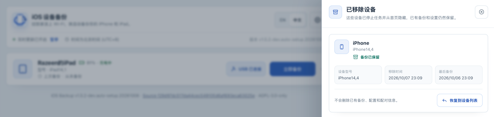

# 管理设备和备份存储

[English](device-storage.md) · [返回操作手册](../OPERATIONS.zh-CN.md)

## 目标与适用条件

把不再使用的设备从控制台移除，需要时重新添加，并正确管理保存位置和存储容量。本页的“恢复到设备列表”只恢复管理状态，不会把备份写回手机。

开始前先分清三种操作：

| 操作 | 影响 | 保留什么 |
|---|---|---|
| 移除设备 | 隐藏设备，阻止后续手动和自动任务；不能用来中断正在运行的任务 | 本地备份、设备配置、保存的密码、配对记录 |
| 恢复到设备列表 | 重新显示设备；保留的自动计划可能在后续检查时再次触发 | 原有数据和设置 |
| 删除备份 | Experimental；不可逆地删除当前保存位置中该设备的整个备份目录，并重置最近备份时间 | 设备本身的数据、设备配置与配对记录；它不是移除设备 |

整机恢复是另外一种会修改手机数据的 [Experimental 操作](experimental.zh-CN.md)。不要按名字相似把它与恢复设备列表混淆。

## 操作前准备

核对设备名称、连接方式和保存位置，等待备份、配对、检查、加密、解包或恢复等操作结束。要保留目前状态用于以后恢复时，先完成[实例备份](instance-recovery.zh-CN.md)。

如果希望以后重新添加设备时仍暂停自动备份，先到“备份设置”关闭“自动备份”并点击“保存设置”。移除设备会保留原设置，不会把自动开关改成关闭。

## 移除一台不再使用的设备

1. **在 Web UI** 找到目标设备，确认它没有活动任务，打开“移除设备”。
2. 阅读“移除这台设备”的说明，点击“移除设备…”。
3. 在确认对话框核对目标设备与影响范围；确认要隐藏它时点击“从控制台移除”。
4. 等待成功提示和首页更新。预期该设备不再出现在活动设备列表，即使它仍在同一网络，也不会自动回到列表。
5. 打开右上角齿轮菜单的“已移除设备”，确认目标设备在列表中。原有备份仍保存在磁盘上，此操作不会释放备份空间。



如果提示设备正在执行任务，先等任务结束；不要通过删除配置或重启服务强行移除。关闭确认框中的“取消”只取消这次移除确认，不是取消备份。

## 恢复到设备列表

1. **在 Web UI** 打开右上角齿轮菜单，选择“已移除设备”。核对目标名称、移除时间和最近备份记录。
2. 如果设备之前启用了自动备份，而你希望先检查设置再接入，先让设备保持离线。重新添加设备不会清除原计划。
3. 点击目标设备的“恢复到设备列表”，等待成功提示。
4. 返回首页检查设备卡片。它可能先显示离线，之后会随设备检测更新连接状态；重新添加设备不会主动建立 USB/Wi-Fi 连接。
5. 打开“备份设置”，核对并保存所需自动开关和路径，再连接设备。需要继续使用时，确认在线、配对和[备份读取](inspection.zh-CN.md)均符合预期。


## 确认备份实际存放在哪里

官方 Compose 的路径对应关系如下。左侧是部署目录下的宿主机路径，右侧是应用看到的容器路径。

| 宿主机位置 | 容器位置 | 用途 |
|---|---|---|
| `./data/backups` | `/backups` | 设备备份及可选解包结果 |
| `./data/configs` | `/configs` | 设备设置、认证状态和加密后的秘密 |
| `./data/lockdown` | `/var/lib/lockdown` | 设备配对记录 |

设备“保存位置”填写的是**容器路径** 。默认值为 `/backups`，实际设备备份通常位于 `/backups/<UDID>`；`<UDID>` 是这里的占位符，表示对应设备标识。当前版本会增量更新该设备的备份集，并不为每次任务自动创建可单独回滚的历史版本。

要保留某次状态，需另行创建一致的独立副本或卷快照，做法见[实例备份](instance-recovery.zh-CN.md)。界面的最近成功时间和任务记录不能替代这样的副本。

## 为尚未开始备份的设备设置保存位置

1. **在主机上** 确认目标存储已通过 Compose 持久挂载到容器，且目录可写、容量足够。沿用官方配置时，在 `/backups` 下选子目录，例如 `/backups/family`。
2. **在 Web UI → 备份设置** 保持自动备份关闭，填写“保存位置”，点击旁边的“检查”。检查会尝试创建目标目录及短暂的写入测试文件；它不验证整机备份所需容量。
3. 显示位置可用后，点击“保存设置”，等待保存成功。默认部署只允许保存在 `/backups` 根目录或其子目录；自定义部署以 `IOSBK_BACKUPS_DIR` 为根。其他挂载点即使“检查”通过，也可能在保存时被拒绝。
4. 重新打开设置核对保存的路径，再完成一次[手动 USB 备份](usb-backup.zh-CN.md)并查看结果。

预期结果是配置保留新路径，且新的设备备份实际写入该路径下的设备子目录。仅“检查”成功不等于已经保存，也不证明有足够的备份空间。

**已有备份时，修改保存位置不会搬动旧数据。** 旧目录仍占空间，新位置可能没有可增量更新的备份，而卡片的最近成功时间可能仍来自旧位置。不要仅改一个字段就视作迁移完成；先关闭自动任务、保护现有实例，再按[实例迁移与恢复](instance-recovery.zh-CN.md)规划复制、挂载和读取核对。

## 检查容量与保留副本

1. **在主机的部署目录** 检查实际备份卷。使用官方相对路径时可运行：

   ```bash
   df -h ./data/backups
   df -i ./data/backups
   du -sh ./data/backups
   ```

2. 核对可用字节空间和 inode，而不仅是应用显示的备份大小。自定义挂载时，把命令路径换成实际宿主机备份路径；部分文件系统的 inode 显示不适用，应结合其管理工具检查。
3. 为完整设备备份、已有备份集更新及额外副本保留余量。实验解包会生成第二份文件；`_unback_` 位于设备备份目录内，也占用同一个卷的空间。
4. 空间不足时先暂停后续自动备份，再扩容，或保留独立副本后清理数据，不要删除唯一已知可用副本。当前不能依靠 `IOSBK_MIN_FREE_BYTES` 自动阻止空间耗尽：该参数尚未用于运行时磁盘空间拦截。
5. 只有确实决定删除当前本地备份时，才进入[实验删除流程](experimental.zh-CN.md)。删除设备整个备份目录也会删除其中的解包结果；其他路径中的独立副本需要单独管理。

## 失败分支

| 现象 | 下一步 |
|---|---|
| 移除/恢复提示忙或状态变化 | 等待当前操作结束，再重新加载列表；不要编辑运行中的配置文件绕过检查 |
| 移除后磁盘没有变空 | 这是保留备份的正常结果；移除不是存储清理 |
| 重新添加设备后开始了备份 | 核对原自动开关与计划，按[自动备份](scheduling.zh-CN.md)停用后续任务；当前任务需要等它结束 |
| 路径检查通过但保存失败 | 确认路径位于配置的备份根内，查看具体错误；不要把宿主机路径直接填入容器路径框 |
| 保存位置改变后找不到旧备份 | 停止继续改路径，核对旧目录和独立副本；设置修改不执行数据迁移 |
| 权限或只读错误 | 核对宿主挂载目录和写入权限，勿扩大无关目录权限 |

## 下一步

定期[备份并演练恢复部署实例](instance-recovery.zh-CN.md)，在[升级](upgrade.zh-CN.md)前再次核对卷与可用空间。设备备份本身是否可恢复，需要独立验证；移除设备、重新添加设备或完成一次备份任务都不能代替恢复演练。
