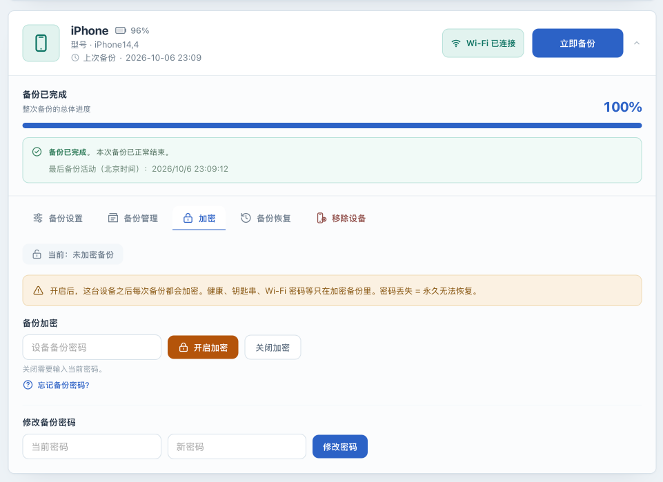

# 管理备份加密和四类密码

[English](encryption.md) · [返回操作手册](../OPERATIONS.zh-CN.md)

## 目标与适用条件

先检查设备是否已开启备份加密，再按需要开启、关闭加密或修改密码。本页也说明各种密码的用途，以及每次操作后该检查什么。备份加密管理属于 **Core** 。

下面的步骤已对照代码和界面核对，但还没有按这些步骤完成开启、关闭、改密或真机恢复测试。请先在有独立备份的非关键设备上测试；这些说明不代表备份已验证可恢复。只执行你需要的操作。

## 先分清四类密码

| 凭据 | 用途 | 如何保管与使用 |
|---|---|---|
| 手机锁屏密码 | 解锁手机，接受信任或本次备份授权 | 在手机上输入；它不是备份解密密码 |
| 设备备份密码 | 加密设备备份数据 | 在应用之外独立保存；已有加密备份可能需要当时的密码 |
| 管理员登录密码 | 登录此部署的 Web UI/API | 默认自动保存到 `data/configs/admin_password` 并维护摘要；自定义配置可能使用其他密码文件；修改方式见[安装与登录](installation.zh-CN.md) |
| 实例主密钥（默认 `secret_key`） | 加密应用保存的备份密码和通知秘密 | 与 `/configs/secrets.enc` 配套保存；它本身不加密手机备份数据 |

重设登录密码不会解锁加密备份。重新生成实例主密钥也不能找回旧备份密码，反而可能导致应用无法读取已保存的密码和通知凭据。已使用的主密钥应保持不变，并与部署数据一起备份到受保护位置。

## 操作前准备

1. **在 Web UI** 关闭目标设备的“自动备份”并保存，等待所有该设备操作结束。
2. 完成[部署实例备份](instance-recovery.zh-CN.md)，保留现有设备备份的独立副本。当前版本不会保证把不同加密设置的备份分开保存，也不保证保留历史版本；不要用唯一副本测试加密设置的更改。
3. 通过已验证的 USB 连接把手机接入 NAS，**在设备上** 按提示输入锁屏密码，或解锁后点击“信任”。无需持续保持解锁或亮屏。
4. 确认当前部署使用原来的有效主密钥，且配置卷可写；不要为本次操作重新生成主密钥。程序会在首次启动时准备主密钥；缺失原密钥或无法解密已有秘密时会拒绝启动。相关错误按[配置参考](configuration.zh-CN.md)处理。
5. 准备并独立保存必要的备份密码。开启需要拟使用的密码，关闭需要当前密码，改密需要旧密码和新密码；不要把任何密码放入截图、命令历史或问题报告。

## 先读取当前状态

1. **在 Web UI** 找到目标设备，打开“加密”。等待状态显示“当前：已开启备份加密”或“当前：未加密备份”。
2. 如果显示离线、读取中或无法读取，先解决连接问题，不要根据旧截图猜测状态。
3. 已有本地备份时，到“备份管理”读取信息和文件清单，按[查看备份](inspection.zh-CN.md)记录是否可读。

这里的状态来自设备对后续备份加密的设置。它不能证明磁盘上所有历史副本采用相同策略，也不能证明当前应用已保存正确密码。一次备份成功同样不能证明加密清单已解密。

## 设备原来已经加密

若之前在 Finder、Apple Devices、iTunes 或另一个实例中开启了备份加密，保留原密码。当前 UI/API 没有独立的“仅保存已有密码”入口；只读查看也没有临时密码输入框。

1. 先尝试上面的只读查看。能够读取时，记录验证的备份和时间，同时继续独立保存密码。
2. 出现 `MBErrorDomain/207`、密码错误或加密清单无法读取时，即使备份任务成功，也不能说明新实例已经能读取旧备份。核对完整 `/configs`（含默认 `secret_key`）及实际使用的外部主密钥是否匹配；完整迁移可参考[实例恢复](instance-recovery.zh-CN.md)。
3. 新实例没有已保存密码时，不要把“开启加密”当成导入按钮，也不要为了导入密码而反复关闭、开启或改密。即使某条错误提示建议用正确密码“重新开启”，它仍是设备状态变更入口，不是单独保存密码。使用此前能够读取该备份的工具验证原密码，并保留独立副本；本版本还没有经过本手册验证的、只导入密码而不修改设备状态的方法。
4. 确实决定改变设备加密策略或密码时，再进入下面的相应的测试步骤。它会修改设备状态，不是补填一个配置值。

## 需要开启加密时

1. 确认当前状态为未加密，已完成本页的准备，并在应用外保存拟使用的设备备份密码。
2. **在 Web UI → 加密** 的“设备备份密码”框输入该密码，点击“开启加密”，阅读并接受密码遗失影响提示。
3. **在手机上** 响应解锁或授权要求。页面“加密设置已提交”只说明后台任务已接收；密码框清空也不代表完成。
4. **在主机的部署目录** 查看 `docker compose logs --tail=200 iosbackup`。等待对应操作结束，核对是否出现“备份加密已开启”，并检查同次操作是否有“密码存储失败”。不要连续重复提交。
5. 重新打开“加密”读取设备状态。确认设备已开启加密，且日志中没有保存密码失败的错误后，再完成一次[手动 USB 备份](usb-backup.zh-CN.md)，随后核对备份信息和加密清单能否读取。

预期结果依次是设备接受加密设置、应用成功保存密码、后续备份结束，以及该备份可读取。这几项需要分别检查。任何一项失败，都应记录当前结果，暂停后续更改；不能只看到“已开启”就恢复自动备份。

## 需要修改备份密码时

1. 确认设备已加密、旧密码已知、独立副本已保存，且设备空闲并通过 USB 在线。
2. **在 Web UI → 加密 → 修改备份密码** 填写“当前密码”和“新密码”，在应用外分别保管旧、新密码及其适用副本，然后点击“修改密码”。
3. **在手机上** 按提示确认。等待日志给出“备份密码已修改”或失败信息，同时检查“新密码存储失败”。“改密已提交”不是最终结果。
4. 状态正常后完成一次手动 USB 备份，再读取信息和清单。保留独立旧副本及其密码，直到分别确认需要保留的备份可读；不能假定一次改密会让所有旧副本自动改用新密码。

## 需要关闭加密时

1. 确认已独立保存当前加密备份和原密码，并理解关闭设备加密不能代替读取旧加密副本所需的密码。
2. **在 Web UI → 加密** 输入当前设备备份密码，点击“关闭加密”，在手机上按要求确认。
3. 等待后台操作结束，查看日志并重新读取设备状态。预期状态为未加密；如果失败或超时，先重读状态，不要假定设备未发生变化。
4. 关闭成功后，应用会尝试移除为该设备保存的备份密码，不能再依赖它保管旧密码。继续保管原密码和独立旧副本，不要因页面显示未加密就丢弃它们。
5. 在保留独立副本的前提下验证后续 USB 备份与读取结果，再决定是否恢复自动计划。

## 失败时如何处理

| 结果 | 下一步 |
|---|---|
| 操作已提交，但尚无结果 | 查看手机与日志；加密开关和改密的后台操作最长等待约 3 分钟，超时后重新核对实际设备状态 |
| 设备加密/改密成功，但保存密码失败 | 设备状态和应用存储已不一致；保留新密码、保持自动备份关闭，检查 `/configs` 的空间和写入权限，不要通过再改一次密码掩盖问题 |
| 主密钥丢失、错误或已保存的密码或通知凭据无法解密 | 查找匹配的配置卷（含 `secret_key`）及自定义凭据配置或外部密钥副本，按[实例恢复](instance-recovery.zh-CN.md)处理；不要生成新密钥覆盖现有状态 |
| 设备离线、忙或锁定 | 等待其他任务结束，通过 USB 重新连接，按手机提示输入密码或确认信任，再核对状态后决定是否重试 |
| 已有备份无法读取 | 查看[清单读取失败](inspection.zh-CN.md)和[排错指南](troubleshooting.zh-CN.md)，不要先删除备份 |
| 忘记设备备份密码 | 先查找自己的密码记录；本项目不能绕过加密。Apple 说明重设备份密码不会让旧加密备份可访问，操作影响见[官方说明](https://support.apple.com/en-us/108313) |

## 下一步

更改完成后，记得备份主机配置和另行保存的密码，具体方法见[实例保护](instance-recovery.zh-CN.md)。只有已经观察到所需备份与读取结果后，再恢复[自动备份](scheduling.zh-CN.md)。整机恢复是独立的 [Experimental 操作](experimental.zh-CN.md)，不属于本页的完成标准。
