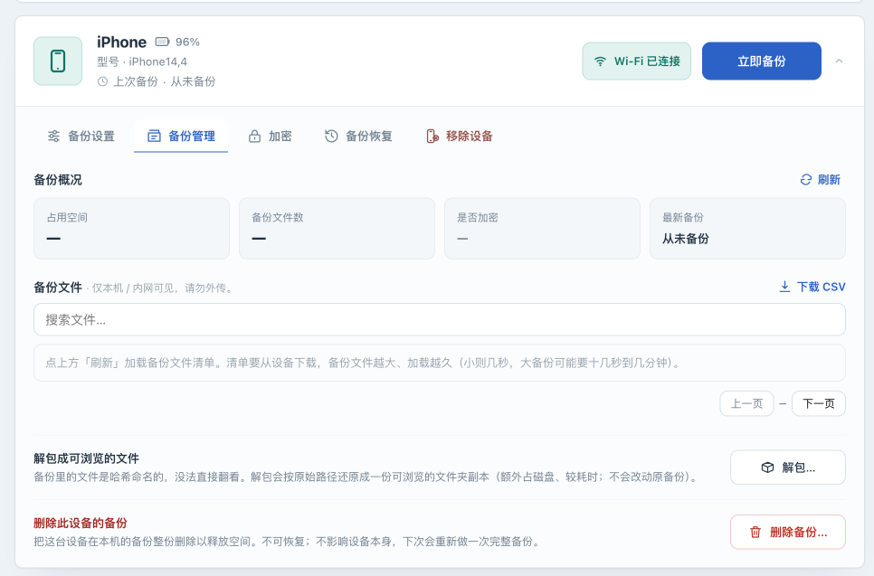

# Understand and validate Experimental operations

[简体中文](experimental.zh-CN.md) · [Operations manual](../OPERATIONS.md)

## Goal and evidence boundary

Local unpack, backup deletion, and whole-device restore affect different data and have different requirements and result checks. Read the details below before using them; they are not yet a tested disaster-recovery procedure. All three are Experimental and disabled by default. For routine needs, start with [read-only inspection](inspection.md) or [removing a device from management](device-storage.md).

Local unpack, deletion, and their protections are implemented and have automated tests. The complete interface workflows have not yet been tested with real devices and backups. This page does not present an unvalidated whole-device restore procedure or claim a supported device/iOS restore combination. Use disposable data copies and non-critical devices for experiments, and take a [deployment backup](instance-recovery.md) first.

See [Feature status](../FEATURE_STATUS.md) for maturity levels and default gates. The sections below describe the actual prerequisites, data effects, and validation steps for each operation.

## Check isolation and gates first

1. Disable and save the selected test device's automatic schedule. Wait for active operations to finish; switching off a schedule does not cancel them. Preserve another checked deployment copy, and ensure the test directory is not the only production backup.
2. To inspect unpack/delete controls, set `services.iosbackup.environment.IOSBK_ENABLE_EXPERIMENTAL_OPERATIONS` to `"true"` in the test deployment's Compose file. Compare custom Compose files with the [configuration reference](configuration.md). Keep authentication enabled and the master key unchanged.

   ```bash
   docker compose config --quiet
   docker compose up -d
   docker compose logs --tail=100 iosbackup
   ```

   Recreate only when no operations are active. This switch does not enable device restore or bypass authentication, CSRF, state, or concurrency checks.
3. Expand the selected device in the UI and open **Backups** . **Unpack…** and **Delete backup…** appear only with the global gate enabled. The current UI disables the whole management area when the device is offline; an offline-capable local API does not mean its UI button is available offline.
4. To inspect controls or take screenshots, stop before triggering an operation. Return the global gate to `false` afterward and wait for any experiment to finish before recreating the container.



## Local unpack: supported scope and controlled validation order

**Goal:** create a browsable copy of ordinary files from an unencrypted backup, organized by domain and original relative path. This is not an alternative full-backup format to import into an iPhone. Device symbolic links are not restored.

1. Confirm that the selected test backup completed and has a regular plain SQLite `Manifest.db`. Do not proceed with an encrypted backup, missing manifest, or missing objects. Allow space for both the original and unpacked copy, and check free space/inodes on the actual host filesystem.
2. Check that `<device-backup-directory>/_unback_` does not exist. Existing output is rejected rather than overwritten. Move it aside only after establishing that it is an old browsing copy, preserving it elsewhere, and stopping related work. Do not remove `Manifest.db`, `Info.plist`, or hashed objects to bypass checks.
3. The implemented UI path is **Backups → Unpack…** , followed by a space/time confirmation. Run it only on an isolated test copy. **Unpack started — see logs** means the request was accepted. A button becoming available again after a few seconds does not mean completion; do not click repeatedly.
4. Observe the result on the host; there is no separate unpack-result page to rely on.

   ```bash
   docker compose logs --since=10m --tail=200 iosbackup
   ```

   The success log contains `unback 解包完成`. Output is first staged in `.iosbackup-unback-*`, then renamed to `_unback_` after normal completion with a `.iosbackup-unback.json` marker. Check the completion time, file/directory counts, and skipped-symlink count, then inspect a sample of non-sensitive file contents. The selected device's settings determine its backup directory; do not assume every backup is at `data/backups/<device-id>`.

**Failure branches:** stop if the manifest is encrypted or not plain SQLite; unpacking that backup type is not supported. Preserve logs and the original for missing objects or unsupported formats. Normal error returns clean up the current staging directory, but power loss or a forced kill can leave remnants. Investigate only after all related processes have ended; remnants are not successful output. A failed operation should not create a new `_unback_`. Old output does not establish a new task's success.

The local API can process a complete unencrypted backup while the device is offline, but still requires authentication, valid CSRF, a managed device, and exclusive operation ownership. This page does not supply API scripts to work around UI conditions.

## Delete backup: establish the target and recovery copy

**Goal:** reclaim the selected device's current local backup directory. This does not erase the iPhone and is distinct from removing the device from the console.

1. Identify the real need using [devices and storage](device-storage.md). To stop managing a device, use reversible **Remove device** . To retain contents, copy them to independent protected storage and verify that copy is readable first.
2. On the test copy, check the device name, configured path, directory size, and any `_unback_` subdirectory. Deletion targets the whole device backup directory, including browsing output. It cannot select one run or individual files. Preserving settings and pairing does not preserve deleted backups.
3. The current **Delete backup…** UI asks for the exact device name; a mismatch does not submit. Cancel if no independent copy exists or the target is uncertain. To validate deletion, use only a disposable copy and preserve the pre-operation inventory.
4. A successful request displays **Backup deleted** . Check that the target directory is absent, the last-backup time is reset, and other devices' directories are unchanged. Cleared space/file counters are supporting evidence only. On failure, inspect whether deletion was partial before doing anything else; do not repeatedly retry.

**Stop conditions:** an only copy of important data, an uncertain path, a busy device, or permission/disk errors. The next backup will need to establish a complete data copy, so reserve space first. There is no Undo action. Recovery depends on the independent copy saved beforehand.

## Whole-device restore: current controls and unverified limits

The device panel has **Restore** , controlled by the default-off **Allow restore (advanced)** switch. It is independent of the unpack/delete global gate. The UI also asks for overwrite acknowledgement, device name, and a Find My check, with backup-password and restore options. The device must be online; the UI's encryption/restore area also depends on master-key availability.

Having restore controls and an implementation does not mean a restore has succeeded on a real device. After **Restore started** , work runs in the background and results must be checked in logs. There is no dedicated page showing the final restore result, nor a documented cancellation or resume workflow. `恢复 restore 完成` records command completion; it does not prove that photos, applications, accounts, settings, and pairing were restored correctly.

This page therefore describes the current restore feature without giving steps to run it on important devices. A proper execution guide first needs a disposable test device and recorded evidence for device/iOS/backup compatibility, correct password, option behavior, start/end results, post-reboot data sampling, applications, and a recovery path after failure. Treat the UI's estimated reconnection time as unverified, and do not assume iOS compatibility has been established.

For a device used daily, use a recovery method you have already tested and retain an independent copy. This project can continue to provide [USB backup](usb-backup.md), [read-only checks](inspection.md), and [deployment-state preservation](instance-recovery.md).

Next: turn off the experimental settings you enabled and retain the test records, and confirm no background operation remains before restoring schedules. Prepare minimal redacted failure information using [troubleshooting and support](troubleshooting.md).
