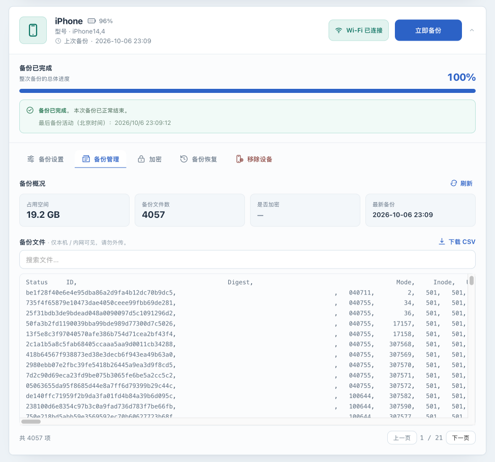
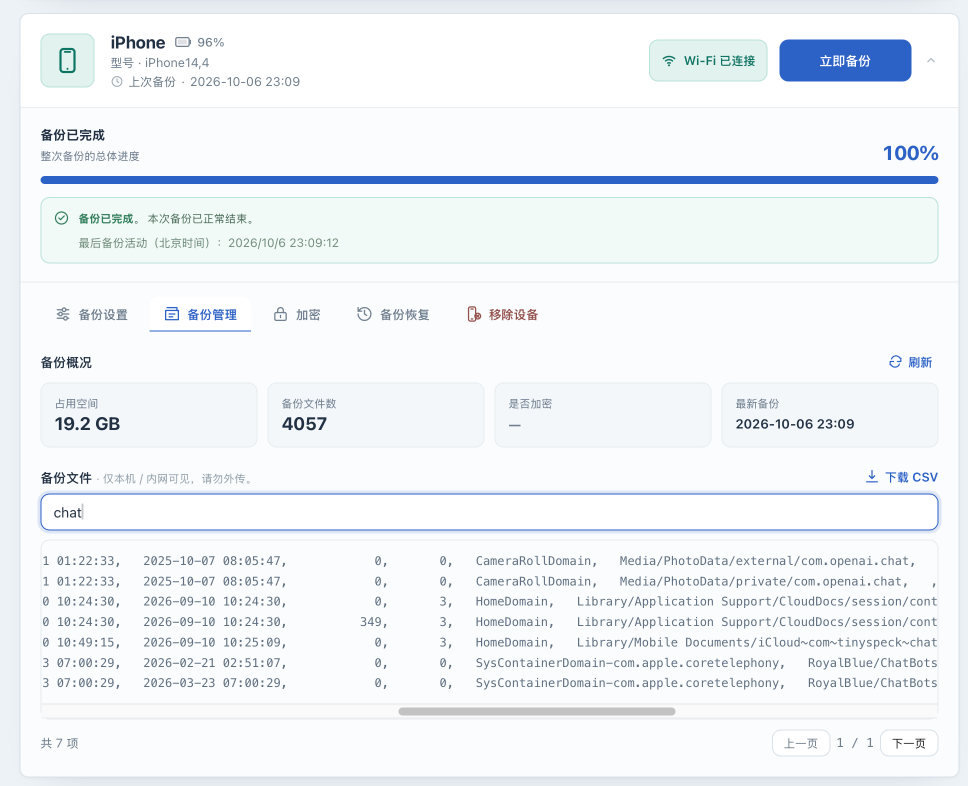

# 查看备份并导出文件清单

[English](inspection.md) · [返回操作手册](../OPERATIONS.zh-CN.md)

## 目标与适用条件

读取一台设备的备份概况和文件清单，按需要下载完整清单 CSV，并了解清单与备份文件的区别。只读查看属于 Core；它不会修改备份，但当前信息和清单查询仍需要设备在线，不是离线文件浏览器。

CSV 包含清单记录，不包含照片、聊天记录或其他文件的实际内容。需要生成可浏览文件副本时，请另外核对[实验操作](experimental.zh-CN.md)的解包范围。

## 操作前准备

- 已完成一次[USB 备份](usb-backup.zh-CN.md)，并知道该设备当前的保存位置。
- 目标设备已配对、在线且空闲。优先使用已验证的 USB 连接，按手机提示输入锁屏密码或完成授权，无需持续保持解锁或亮屏。
- 若备份加密，当前实例需要可用的主密钥及正确保存的设备备份密码。新实例完成了一次加密备份，也不代表它已保存正确的备份密码，详见[加密与密码](encryption.zh-CN.md)。
- 为读取大清单留出等待时间。不要同时启动新的备份或修改保存位置。

## 读取备份概况与文件清单

1. **在 Web UI** 找到目标设备，确认没有活动任务，打开“备份管理”。如果出现“设备离线，备份管理暂不可用”，先重新连接设备。
2. 点击“备份概况”旁的“刷新”。页面先读取信息，再读取文件清单；大备份可能需要几十秒到数分钟，避免连续点击刷新。
3. 观察“占用空间”“备份文件数”“是否加密”“最新备份”和下方清单。占用空间来自磁盘目录统计；最新备份时间是应用记录的最近成功时间，不能单独证明当前目录完整或可读。
4. 等待下方出现文件记录或明确错误。只有占用空间有数字而清单为空、加密状态为 `—`，还不能算成功读取清单；信息查询失败时页面仍可能显示已统计出的空间。
5. 记录此次是否读到了备份信息和清单。需要对外说明验证范围时，把它与“任务已完成”“真机恢复成功”分开记录。

## 搜索已加载记录

1. 在“搜索文件…”输入框中输入希望匹配的关键词；下方列表会筛选当前已加载记录。
2. 使用“上一页”“下一页”翻页。每页展示最多 200 项，Web UI 总共最多加载 **5000 项** 。
3. 留意“已截断，完整请下载 CSV”提示。搜索仅覆盖已加载的这些项；“无匹配”不能证明整个备份没有该文件。

列表会显示已加载记录中符合搜索条件的文件。清单是路径和元数据的索引；看到文件名不等于已打开文件内容，也不验证备份包含手机上所有数据。

## 下载完整文件清单 CSV

1. 保持设备在线且没有其他任务，点击“下载 CSV”。它会重新读取完整清单，不是导出当前搜索结果，也不受 Web UI 的 5000 项展示上限限制。
2. 等待浏览器下载结束。设备离线、连接中断或授权失败时，下载可能失败或不完整；仅出现下载文件或 HTTP 成功状态不证明清单完整。
3. **在本机** 用能够读取 CSV 的文本或表格工具查看文件，检查是否有合理的清单记录。若之前成功加载时显示了完整总数，可对照记录数量；不要用简单文本行数代替带引号、可能含换行的 CSV 记录数。
4. 将清单存放在受保护位置。下载文件名可能包含设备标识，内容可能包含敏感路径；提交问题前同时处理文件名和内容，优先只提供必要的脱敏片段。

下载后应能正常打开 CSV，并确认其中的记录对应本次查询的备份。CSV 不能作为设备备份副本，不能替代 `/backups` 的独立备份，也不是整机恢复输入文件。

## 常见失败分支

| 现象 | 下一步 |
|---|---|
| 设备离线，备份管理灰显 | 用 USB 重新连接并按手机提示完成授权，等待在线后再读取；磁盘上有备份不代表当前 UI 支持离线清单查询 |
| 提示设备正在备份 | 等备份结束后再刷新，不要为了看清单中断正在进行的备份 |
| 提示没有备份 | 核对设备与保存位置；如果刚改过路径，旧备份不会自动移动到新位置。查看[设备与存储](device-storage.zh-CN.md) |
| `MBErrorDomain/207`、密码错误或加密清单失败 | 按[加密与密码](encryption.zh-CN.md)核对原密码、主密钥与配置卷；不要通过删除备份或关闭加密来修复读取 |
| 有空间数字，但信息或清单为空 | 这表示只取得了部分信息；查看同次查询日志，核对设备状态与密码，不能推断为空备份或未加密 |
| 大清单很慢或下载中断 | 保持设备在线，等待旧查询结束；用 USB 重试一次，仍失败则保存脱敏错误按[排错指南](troubleshooting.zh-CN.md)处理 |
| 搜索无结果且显示已截断 | 下载完整 CSV 再搜索，不能从局部列表断定文件不存在 |

## 下一步

将“任务结束”“信息/清单可读”“实际文件内容检查”“真机恢复演练”作为不同的验证结果，含义见[状态参考](states.zh-CN.md)。需要保护实际数据，继续[备份整个部署实例](instance-recovery.zh-CN.md)；需要本地解包或设备恢复，先阅读[实验操作](experimental.zh-CN.md)。
