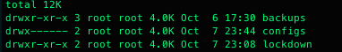
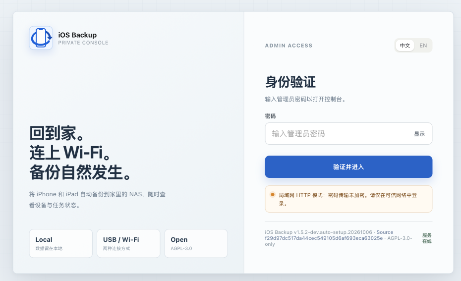

# Install on Linux, sign in, and protect administrator access

[简体中文](installation.zh-CN.md) · [Operations manual](../OPERATIONS.md)

## Goal and prerequisites

After these steps, you can sign in, locate the three data directories and the password and key files, and continue with USB pairing. This page is for a **fresh Linux Docker Compose deployment** . Existing instances should use [upgrade](upgrade.md) or [instance recovery](instance-recovery.md); Synology has a [separate guide](synology.md).

Prepare Docker Engine, the Compose plugin, and sufficient protected local storage. Diagnostic commands below also use curl on the host. Your account needs Docker access. The default installation uses the supplied Compose file; Git, OpenSSL, and pregenerated keys are unnecessary.

## 1. Save Compose and confirm the deployment location

Download the [compose.yaml](../../compose.yaml) that accompanies your selected image into a new `$HOME/iosbackup-deploy` directory, or another new directory on your chosen disk. Run subsequent commands in that actual directory. Do not treat an existing data directory as a fresh instance.

```bash
cd "$HOME/iosbackup-deploy"
docker version
docker compose version
ls -ld /dev/bus/usb /run/udev
df -h .
df -i .
docker compose config --quiet
```

Allow room for a complete device backup and additional headroom. `config --quiet` validates Compose syntax. Do not share full `docker compose config` output: advanced settings may expand secrets. If the image is missing, access is denied, or its architecture does not match, confirm the source with the maintainer rather than substituting an unfamiliar image.

| Setting | Requirement |
|---|---|
| Three writable mounts | `./data/backups:/backups`, `./data/configs:/configs`, `./data/lockdown:/var/lib/lockdown` |
| Device mounts | `/dev/bus/usb:/dev/bus/usb` and `/run/udev:/run/udev:ro`; source paths must exist |
| Temporary directories | `/tmp` and `/var/run` use tmpfs; persistent data belongs in the three data volumes above |
| Privileges and network | Retain the supplied `privileged: true` and `network_mode: host`; do not add `ports` |
| Administrator authentication | Keep `IOSBK_AUTH_ENABLED=true`; password-file and master-key variables need no default values |
| Port | Compose defaults to `9000`; the process without Compose defaults to `8080` |

The default listens on all host interfaces. Check that the port is free and restrict firewall sources. Prefer an HTTPS reverse proxy or protected tunnel across hosts. Do not forward the port publicly or disable authentication. See [advanced configuration](configuration.md) for custom ports, directories, and credentials.

## 2. Start and save the initial password

Run in the **deployment directory on the Linux host** :

```bash
docker compose up -d
docker compose ps
docker compose logs iosbackup
```

With no existing credentials or explicit password configuration, the app generates a random administrator password in `data/configs/admin_password` and stores its digest in `auth_credentials.json`. The password appears in the startup log only when generated. Only when no supplied or stored key exists and `secrets.enc` is absent does the app create `data/configs/secret_key`; this master key is never logged. Restarts, upgrades, and container recreation reuse these files.

The app sets its dedicated configuration directory to `0700`; newly generated secret files use `0600`. The default container user is root, so reading the files on the host usually requires sudo. Check host/NAS permissions for `data/backups` and `data/lockdown` separately; do not assume those directories become owner-only automatically. Protect the whole deployment directory and its backups.



## 3. Sign in and verify the instance

1. **Browser:** open your protected address. A temporary trusted-LAN example is `http://<host-address>:9000/`; HTTP does not encrypt passwords.
2. Enter the administrator password from the first-start log and click **Verify and continue** . The Web form takes only a password; the API Basic Auth username is always `iosbackup`.
3. Check the displayed version, open the **first-use wizard** , choose **Skip for now, use USB only** , and continue to [USB pairing and the first backup](usb-backup.md).

Cold startup may take tens of seconds. For diagnostics, run these commands on the host: the first retries the connection within a time limit, and the second checks the version:

```bash
curl -fsS --retry 12 --retry-connrefused --retry-delay 5 --retry-max-time 90 http://127.0.0.1:9000/healthz
curl --fail --user iosbackup http://127.0.0.1:9000/api/version
```

The second command prompts for the password instead of putting it on the command line. Record `version`, `commit`, and `build_date`. `/healthz` checks HTTP responsiveness, not USB, disk space, or backup success. Browser sessions last 12 hours and live in memory; restart requires signing in again. Use **Sign out** from the menu to exit.



## Retrieve or change the administrator password

If you can no longer find the first-start log, read the default file from a **protected Linux host terminal in the deployment directory** :

```bash
sudo cat data/configs/admin_password
```

Do not put the output in Issues, screenshots, or shared terminal transcripts. The scratch-based image contains no shell or cat, so do not run this inside the container. An explicitly configured instance uses its selected password file.

To change the administrator password, create a **separate custom password file** using [advanced credential configuration](configuration.md#advanced-credential-configuration), explicitly set `IOSBK_ADMIN_PASSWORD_FILE`, and recreate the container. Preserve the existing default password and digest. Editing default `admin_password` alone causes a digest mismatch and startup refusal. Do not delete `/configs`, change the master key, or change the device backup password to repair login.

## Failure paths

| Symptom | Check and next step |
|---|---|
| Container repeatedly exits | Read the log in the deployment directory and check the reported password, key, path, or port. If a setting you supplied is invalid, the app will not use a default value to continue; fix the specific error. |
| `secrets.enc` exists but its key is missing or decryption fails | Restore matching `secret_key` or the original external key. No replacement key is generated. See [instance recovery](instance-recovery.md). |
| Default password and authentication digest disagree | Restore matching default files or use an explicit custom password file; do not delete the digest as an experiment. |
| Page cannot be opened | Test `/healthz` on the host first, then client networking, firewall, port, and proxy. A host-side failure calls for checking logs. |
| Incorrect username/password | Confirm that you opened the right instance and check the password file it uses; do not enter the phone passcode or backup password. Restart after changing a custom file. |
| `permission denied` / `read-only file system` | Check actual bind-mount paths, writability, and NAS ACLs. |
| Initialization reports unsupported hard links | The configuration directory needs a local filesystem supporting hard links; see [configuration](configuration.md). The app does not fall back to an unsafe write method. |
| mux-service port conflict | Identify host mux services or other host-network instances and active jobs before arranging a maintenance change. |

Installation is complete once you can sign in, confirm the version and data directories, and pass the host health check. Phone backup has not been tested at this point. Continue to the [first USB backup](usb-backup.md), then arrange a [complete instance backup](instance-recovery.md).
