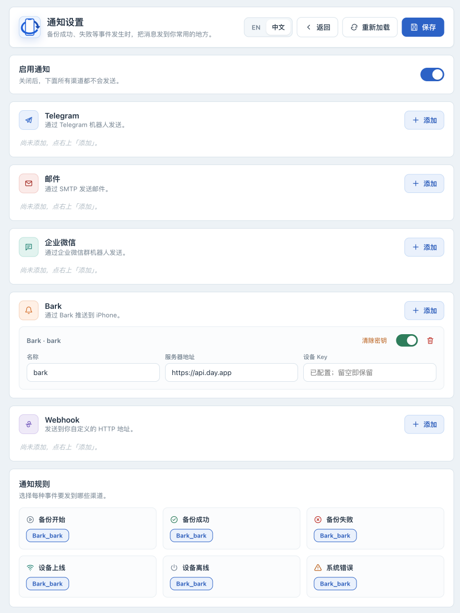
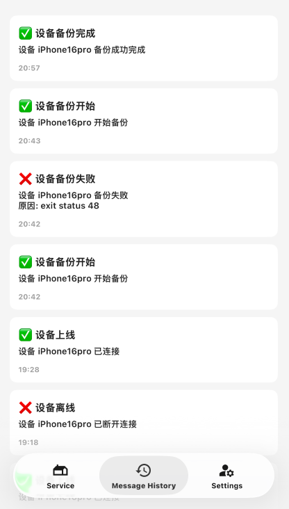

# 配置通知并确认真实事件

[English](notifications.md) · [返回手册](../OPERATIONS.zh-CN.md)

按本页配置后，先发送测试消息，再检查所选渠道能否收到真实备份通知。通知会向你选择的服务发送设备名称、标识、事件、时间和可能的错误内容，选择接收者前请确认这些信息可以分享。发送失败不会使已完成的备份变成失败；通知不能替代界面和日志检查。

## 操作前准备

已按[安装指南](installation.zh-CN.md)登录管理员页面，并保护好默认 `secret_key` 或原外部主密钥。准备一个专用于备份的通知目标及相应凭据；按服务提供者的现行文档创建凭据。以下字段、事件和模板已对照当前实现核对。自建 Webhook 先阅读[请求协议与网络限制](../WEBHOOK_GUIDE.md)。

### 渠道字段

| 渠道 | 准备的信息 | 使用条件 |
|---|---|---|
| Telegram | Bot Token、Chat ID | 先按 Telegram 文档建立机器人与接收会话。当前消息使用 Markdown，特殊字符造成拒收时检查发送日志。 |
| Email | SMTP 主机、端口、用户名、密码、发件人、收件人 | 465 使用隐式 TLS；其他端口尝试 STARTTLS。配置用户名却不支持 STARTTLS 时拒绝发送凭据。通常使用应用专用密码。 |
| WeCom | 群机器人 Webhook URL | 要求 HTTPS，按企业微信现行群机器人文档创建。 |
| Bark | 服务地址、Device Key | 服务默认地址可用 [https://api.day.app](https://api.day.app)；自建服务与 Webhook 共用私网目标限制。 |
| Webhook | URL、方法；API 可配置 Header | 支持 POST / PUT / PATCH，空方法使用 POST。当前 UI 没有自定义 Header 输入项。 |

## 添加渠道、规则并保存

1. **在 Web UI** ：打开“通知设置”，开启“启用通知”。关闭总开关时，所有渠道都不发送。
2. 在选定渠道下点击“添加”，设置易识别且在同类渠道中唯一的名称，填写目标和凭据，开启该渠道。
3. 在“通知规则”中，分别为“备份开始”“备份成功”“备份失败”选择刚添加的渠道。只开启渠道而不选事件规则，不会收到对应事件。
4. 初次配置先使用默认模板；有需要时再按本页[正文模板](#正文模板)修改“消息模板”。
5. 点击“保存”，确认“已保存”。重新加载后核对开关、名称和规则；密码等字段显示“已配置；留空即保留”是正常的，浏览器不会再次显示已保存的内容。



## 测试送达，再验证真实事件

1. 在“测试”区域选择“备份成功”，点击“发送测试通知”。此操作会实际发送消息给该事件配置的渠道。
2. **在接收端** ：检查是否收到带测试字样的消息，并核对目标和时间。页面的“已发送”提示本身不能证明每个渠道都已送达；当前界面不会完整显示各渠道的测试结果。
3. 多个渠道分别核对；测试失败时先查看日志和本页[失败分支](#收不到消息时)。需要进一步判断时，可在浏览器开发者工具中按[测试响应](#测试响应)检查本次 `/api/notifications/test` 的逐渠道结果，不要分享请求头中的凭据或 CSRF token。
4. **在设备页面** ：按[USB 首次备份](usb-backup.zh-CN.md)启动一次允许的真实备份。确认收到“备份开始”，任务完成后收到“备份成功”。不要故意断线或制造数据错误来测试失败通知；使用测试事件验证失败消息格式即可。
5. 保留一次成功验证的日期、渠道名称和应用版本。没有通知时仍应检查任务真实结果。



## 修改凭据、名称或停用通知

已有密码、Token 等输入框留空表示保留旧值。更换时输入新值并保存，再发测试；Webhook 秘密替换包含 URL 和 Header：通过 UI 改 URL 会清除先前由 API 设置的 Header。带自定义 Header 的渠道应按 [Webhook 参考](../WEBHOOK_GUIDE.md)通过 API 同次提供新 URL 和完整 Header，再测试。不要通过更换实例主密钥来轮换单个渠道凭据。

规则引用完整通知器名称：`Telegram_<name>`、`Email_<name>`、`Wecom_<name>`、`Bark_<name>`、`Webhook_<name>`，UI 会生成这些名称。秘密按名称索引，重命名后留空不能继承旧秘密。需要重命名时：

1. 保持旧渠道启用，在所有事件规则中取消它并保存。
2. 修改名称，重新输入凭据，为新名称分配规则，然后保存。带 Header 的 Webhook 同样需要通过 API 提供完整秘密。
3. 重新加载核对名称和规则，再发送测试确认送达。不要只改名称后点保存。

临时停用所有通知可关闭总开关后保存。只停用、清除密钥或删除某个渠道时：

1. 先保持该渠道开启，在每种事件规则中取消它并保存。
2. 关闭渠道、点击“清除密钥”或删除渠道，然后再次保存。“清除密钥”也会停用该项。
3. 重新加载核对。残留规则引用会导致保存失败，而关闭后的渠道可能已经不显示在规则选项里；遇到这种情况先重新开启，再清理规则。停用不会删除已有备份。

## 事件参考

| 事件 | 触发范围 |
|---|---|
| `backup_start` | 条件检查通过，即将运行备份命令。 |
| `backup_success` | 备份任务成功完成；不等于真机恢复验证。 |
| `backup_failed` | 已启动的备份命令失败；如果在检查条件或启动命令时就失败，不保证触发此事件。 |
| `device_online` | 程序检测到设备从离线变为在线。 |
| `device_offline` | 持续未检测到设备，且已超过对应的等待时间。 |
| `system_error` | 应用通过统一错误日志入口记录系统错误。 |

## 正文模板

每种事件可配置一份正文模板，留空使用内建默认值。支持 `${title}`（内建标题）、`${content}`（原正文）、`${device_name}`、`${device_udid}`、`${timestamp}`（北京时间 RFC 3339）、`${type}`、`${level}`、`${reason}`（失败原因）。未知变量会被拒绝；并非所有事件都含设备信息或失败原因。

```text
[${type}] ${device_name}
${content}
${timestamp}
```

模板影响各渠道正文；Webhook 的其他 JSON 字段保留。修改模板后保存并发送相应事件的测试消息，检查正文和变量是否符合预期。

## 秘密存储与 API 检查

在默认容器路径下，Bot Token、SMTP 密码、企业微信 URL、Bark Device Key、Webhook URL/Header 使用实例主密钥加密存储在 `/configs/secrets.enc`（默认密钥在 `/configs/secret_key`，高级覆盖见[配置参考](configuration.zh-CN.md)）。普通设置在 `/configs/notification_configs.json`。主密钥必须和这些文件一起受保护备份，保持匹配；不要把真实配置提交到 Git。迁移时按[实例恢复](instance-recovery.zh-CN.md)准备匹配副本。

GET 配置不会返回秘密原值；`configured: true` 表示已保存。以下只读命令在宿主机执行，curl 会提示输入管理员密码；端口变化时相应替换：

```bash
curl --user iosbackup http://127.0.0.1:9000/api/notifications/status
curl --user iosbackup http://127.0.0.1:9000/api/notifications/config
```

输出仍可能含目标名称、账号和规则，分享前需要脱敏。保存配置和发测试均为状态修改操作，需要当前认证，以及页面 `iosbk-csrf` meta 值对应的 `X-IOSBK-CSRF` 请求头；日常使用 UI 完成。`POST /api/notifications/config` 保存整个通知配置，不能将片段当局部补丁，否则可能移除其他渠道或规则。Header 配置及示例见 [Webhook 参考](../WEBHOOK_GUIDE.md)。

### 测试响应

`POST /api/notifications/test` 会实际发送消息。响应包含 `attempted`、`succeeded`、`failed` 与逐渠道 `deliveries`：

| HTTP 状态 | 含义 |
|---|---|
| `200` | 所有尝试成功 |
| `207` | 部分尝试失败 |
| `502` | 尝试全部失败 |
| `409` | 未尝试任何渠道 |

其他输入错误单独返回。以实际收件及响应为准，不单看当前 UI 提示。真实事件的通知会先进入容量有限的队列，再在后台发送。队列满时可能丢弃消息，停机也可能影响发送；这些待发送消息不会持久保存。

## 收不到消息时

| 现象 | 先检查 | 下一步 |
|---|---|---|
| 测试未尝试发送 | 总开关、渠道开关、测试事件的规则 | 保存后重试一次；没有选中通知器时响应可能为 `409` |
| 部分渠道失败 | 每个目标实际收件情况 | 查看 `deliveries` 或容器日志，逐个处理 |
| SMTP 失败 | 主机、端口、认证、TLS、发件/收件地址 | 按[渠道字段](#渠道字段)核对 465 隐式 TLS 或 STARTTLS，不关闭证书校验 |
| Webhook 返回 401/403 | 接收端鉴权要求 | 核对 URL/Header，避免把完整授权值贴进日志 |
| 私网 Webhook/Bark 被拒 | 目标 IP、HTTPS 和允许网段 | 按 [Webhook 参考](../WEBHOOK_GUIDE.md)添加最小私网 CIDR，再重建容器 |
| 测试收到、真实备份未收到 | 真实事件规则及任务是否真正开始 | 条件检查或命令启动前失败不保证触发 `backup_failed` |
| 迁移后秘密不可读 | 主密钥是否与 `secrets.enc` 匹配 | 恢复原密钥和匹配副本，不删除秘密文件试错 |

```bash
docker compose logs --tail=200 iosbackup
```

准备求助时按[排错指南](troubleshooting.zh-CN.md)脱敏。配置完成并核对测试及真实事件后，可继续[自动备份](scheduling.zh-CN.md)。
