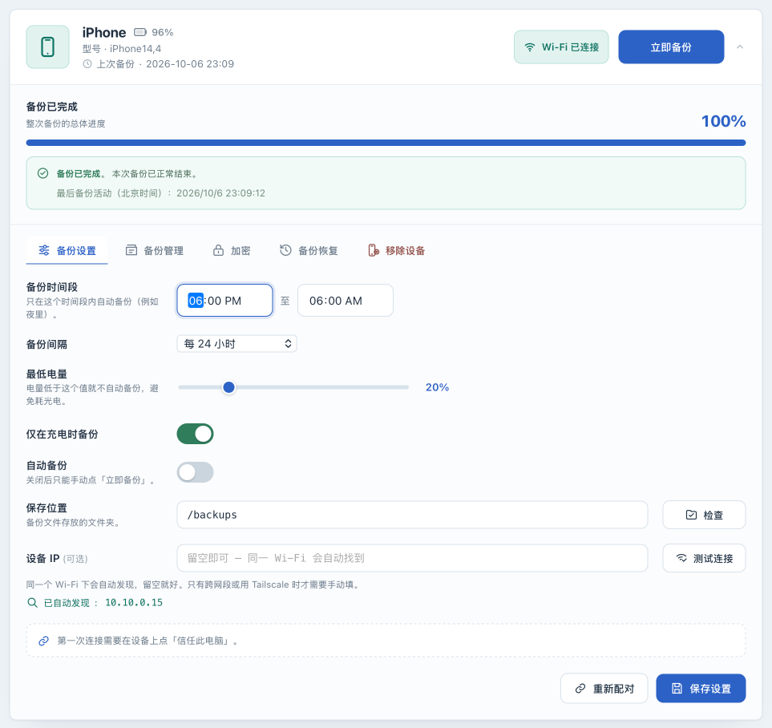

# Configure and observe automatic backups

[简体中文](scheduling.zh-CN.md) · [Back to the operations manual](../OPERATIONS.md)

## Goal and requirements

Configure automatic backup for one device and observe an eligible job from start to finish. Automatic backup is Core functionality. Complete a [first USB backup](usb-backup.md) before enabling a schedule. If jobs will use Wi-Fi, also complete [Wi-Fi validation](wifi.md).

A schedule controls when the application tries to start a job. It does not guarantee completion at a particular minute. When a backup wakes the phone, iOS may display a white passcode screen. Enter the device passcode when prompted; there is no need to unlock the phone in advance or keep its screen on. Automatic backup does not remove that authorization step.

## Before you begin

Make sure the target device is online, no operation is running, the backup location has enough space, and you can respond to phone prompts during the window. Note the last successful backup time: a recent manual backup also delays the earliest eligible automatic backup.

These are the defaults for a new device. For an existing device, use the values saved in its settings.

| Setting | Default | Meaning |
|---|---|---|
| Automatic backup | Off | After you enable and save this setting, the app checks the schedule and starts eligible backups |
| Backup window | 18:00 to 06:00 | Beijing time, across midnight; includes 18:00, excludes 06:00 |
| Backup interval | 24 hours | At least 24 hours since the last successful backup |
| Minimum battery | 20% | A backup should not start below this level |
| Only back up while charging | On | The device must report that it is charging |

Windows use Beijing time (UTC+8), regardless of your browser's timezone. For example, 18:00 in the interface is 10:00 in a UTC+0 location. The window controls when new jobs start; a running job is not stopped merely because the window ends. Set different start and end times to avoid configuring the wrong backup window.

**Battery and charging conditions also apply to “Back up now.”** Turning automatic backup off does not bypass them.

## Set an overnight schedule

1. **In the Web UI** , find the target device and open **Backup settings** . Check its name and connection type so that you do not change another device.
2. Set **Backup window** to `18:00`–`06:00` and **Backup interval** to **Every 24 hours** . This is an overnight example; adjust the window to a time when you can respond to phone authorization prompts.
3. Set **Minimum battery** to `20%` and leave **Only back up while charging** on. **On the phone** , connect power, then check the charging state reported on its device card.
4. Keep **Save location** at the container path you have already validated, such as the default `/backups`. Do not move the backup directory as part of this schedule change.
5. Turn **Automatic backup** on and select **Save settings** . Wait for **Settings saved** ; the settings are saved only after the **Unsaved changes** indicator clears.
6. When no job is running, reopen the page and confirm that the window, interval, and switches retain their new values.

## Observe the first automatic run

1. **In the Web UI** , check the last successful backup time. If a manual backup just finished and the interval is 24 hours, another backup will not start immediately even inside the window. Do not delete backups or edit historical timestamps to force a run.
2. At the next eligible window and interval, keep the device online and powered, and watch for authorization prompts. The app checks the conditions every **30 seconds** by default, so jobs do not start at an exact second.
3. Wait for the device card to enter a backup state and authorize the operation on the phone if asked. To confirm the trigger, run `docker compose logs --tail=200 iosbackup` in the deployment directory and look for `自动备份触发` at the matching time. Remove device identifiers, addresses, and private paths before sharing logs.
4. Wait for an explicit **Backup completed** or failure state. On success, check the updated backup time and then inspect the read-only information under [View backups](inspection.md).

## If it does not start, fails, or needs to be paused

| Symptom | Check and next action |
|---|---|
| No job at the expected time | Check the Beijing-time window, last success, interval, and whether the enabled switch was saved |
| Device is offline or removed | Reconnect it; removed devices are not scheduled. See [Device management](device-storage.md) |
| Charging or battery conditions fail | Connect power and wait for the reported state to update; “Back up now” does not bypass these settings |
| Another operation is running | The default permits one backup job at a time. This check can be skipped and a later check can try again if eligible; there is no guaranteed queue order |
| Authorization wait ends in failure | Check the phone and [State reference](states.md), address the cause, then retry when the device is available |
| Repeated failures | Turn automatic backup off and save, preserve the evidence, and follow [Troubleshooting](troubleshooting.md). Failure does not replace the last successful backup timestamp |

To pause future automatic jobs, open **Backup settings** , turn **Automatic backup** off, select **Save settings** , and confirm the save. This does not cancel a running job or a job already undergoing its startup check. The current version has no backup cancel button; closing the browser does not stop the backup. Wait for the job to end before maintaining the device.

Re-adding a removed device preserves its settings. If automatic backup was on, a later scheduler check can start another job. To keep it disabled, turn it off and save before removing the device.

## Next steps

Configure [notifications](notifications.md) for real success and failure events, and regularly [protect the deployment instance](instance-recovery.md). See [Configuration reference](configuration.md) for field ranges, concurrency limits, and the startup setting for the scheduler interval.
