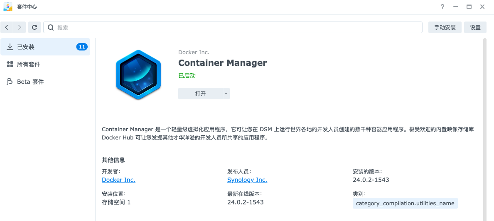
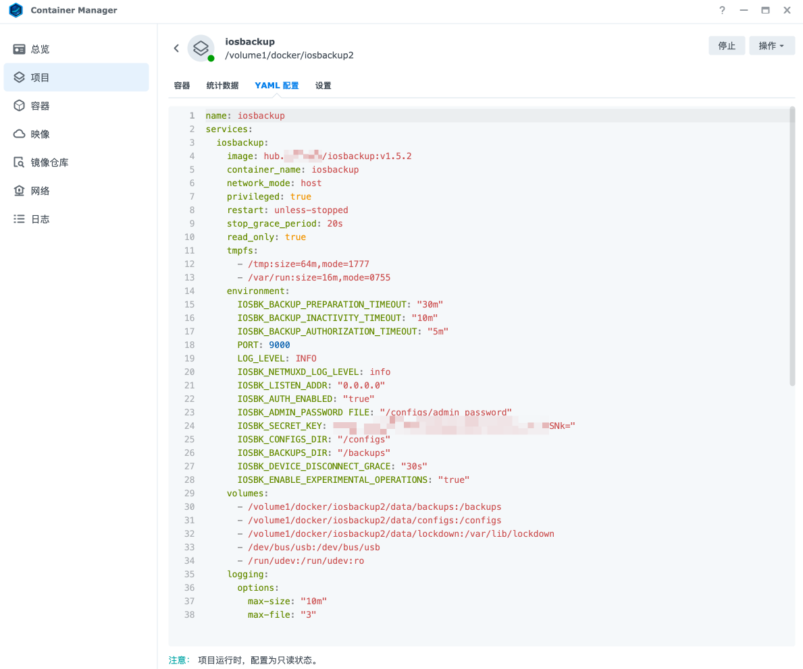
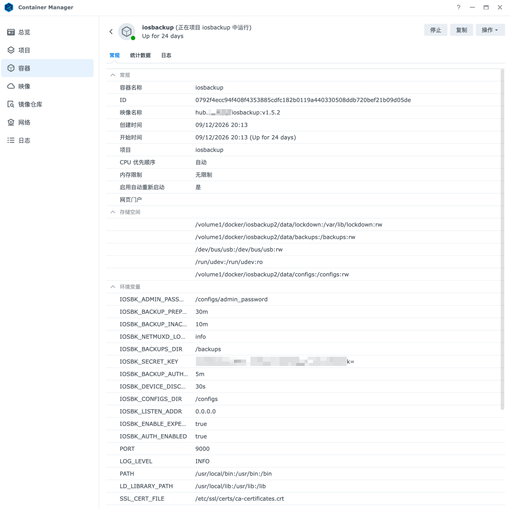

# Deploy on Synology DSM and validate a USB backup

[简体中文](synology.zh-CN.md) · [Back to the operations manual](../OPERATIONS.md)

## Goal and prerequisites

Use **Container Manager's Project interface** to deploy: prepare a shared folder → import Compose → start the project → retrieve the password and sign in → complete your first USB backup. The main procedure uses DSM and your browser. Use the optional SSH section at the end when you need further diagnostics.

Prepare a DSM administrator account, an iPhone/iPad whose passcode you know, a USB data cable, and a local storage volume with enough capacity.

- Use DSM 7.2 or later on a model whose Package Center provides a compatible **Container Manager** . Project supports Compose; DSM requirements vary by package version. See [Synology's release notes](https://www.synology.com/en-us/releaseNote/ContainerManager?os=DSM&version=7_x_series).
- Images support `linux/amd64` and `linux/arm64`; the NAS CPU architecture must match. Container Manager availability alone does not establish that every model can run this image or access USB devices.
- For an existing instance, use [Upgrade and rollback](upgrade.md) or [Instance backup and recovery](instance-recovery.md). Do not treat an existing data directory as a fresh deployment.

Interface entry points follow Synology's official documentation. Button labels can vary by DSM version and language. Verify USB support on your model with the actual backup at the end of this procedure.

## 1. Install Container Manager and check storage

1. Sign in to DSM, find Container Manager in **Package Center** , and install it. Open it directly if already installed.
2. Confirm that **Project** appears in the sidebar. If you have only the older Docker package or no Project entry, check model and package compatibility first.
3. In **Storage Manager** , check free capacity on the target volume. Compare it with the phone's used storage under **Settings → General → iPhone Storage** , leaving headroom for backups and NAS operation.
4. In Container Manager's project and container lists, check for an already-running iOS Backup instance. Wait for any active backup to finish first.



## 2. Prepare the deployment directory in File Station

1. Open **File Station** and select the shared folder for backups, such as `docker`. If you need a shared folder, create one under **Control Panel → Shared Folder** on the target volume.
2. Create an `iosbackup` folder inside it. The example full path is `/volume1/docker/iosbackup`; your volume might be `volume2`, and your shared-folder name might differ. Use the actual directory throughout.
3. Check shared-folder permissions and directory properties to allow access only to the accounts managing this instance. The configuration directory needs a local filesystem supporting hard links; see [Configuration reference](configuration.md).
4. On your computer, download the matching [compose.yaml](../../compose.yaml) and rename it to `docker-compose.yml`, preserving all contents, for upload in the next step.

The default installation creates data directories and credentials automatically. Import the supplied Compose file; you need not generate passwords or a master key. After project creation, the data directories map as follows:

| Example NAS directory | Container directory | Contents |
|---|---|---|
| `/volume1/docker/iosbackup/data/backups` | `/backups` | Device backups |
| `/volume1/docker/iosbackup/data/configs` | `/configs` | Administrator password, master key, and application configuration |
| `/volume1/docker/iosbackup/data/lockdown` | `/var/lib/lockdown` | Device pairing records |

Compose resolves `./data/...` relative to the project working directory. Your project path determines where data is stored; do not move it casually after backups have started.

## 3. Import Compose in Project and start it

1. Open **Container Manager → Project → Create** .
2. Set the **Project Name** , such as `iosbackup`, and select the new deployment directory as **Path** , such as `/volume1/docker/iosbackup`.
3. For **Source** , upload your computer's `docker-compose.yml`. Alternatively, create a file in the editor and paste the entire original Compose configuration.
4. Check that the configuration retains these settings:

   | Setting | Required value or purpose |
   |---|---|
   | Image | Default `ghcr.io/razeencheng/iosbackup:latest` |
   | `network_mode` | `host`, using the NAS network |
   | `privileged` | `true`, for device access |
   | Data mounts | `./data/backups`, `./data/configs`, and `./data/lockdown`, mapped to the three container directories above |
   | USB mount | `/dev/bus/usb:/dev/bus/usb` |
   | udev mount | `/run/udev:/run/udev:ro` |
   | Listening port | `9000` by default |

5. Leave the Web Station portal option disabled. Access the application using the NAS address and application port.
6. Confirm the summary, select **Done** , and choose to start the project afterward. Wait for the image download and container creation; the first download can take some time.
7. Confirm that the project's `iosbackup` container is running. If the project was created without starting, use **Action → Build** and then **Start** . This uses the image specified in Compose; you do not need to compile the source yourself.

See [Synology's Project help](https://kb.synology.com/en-global/DSM/help/ContainerManager/docker_project) for the creation wizard and project actions. Start, stop, and update the application through this project rather than creating a duplicate with the single-container wizard.

Host networking needs no additional port mapping. The application port defaults to `9000`, separate from DSM's administration port. If DSM Firewall is enabled, use **Control Panel → Security → Firewall** to allow trusted management sources to reach that TCP port while retaining existing management rules. See [Synology's Firewall help](https://kb.synology.com/index.php/en-us/DSM/help/DSM/AdminCenter/connection_security_firewall?version=7). Do not expose the Web UI directly to the public internet.



## 4. Read container logs and sign in

1. Under **Container Manager → Container** , select `iosbackup` and open **Details → Log** . This shows the application's output. Container Manager's general activity log is not where the initial password appears. See [Synology's Container help](https://kb.synology.com/en-global/DSM/help/ContainerManager/docker_container).
2. Find the administrator password generated at first startup and store it securely. It appears only when generated; the master key is never logged. Hide the password in screenshots and shared logs.
3. Open `http://<NAS-address>:9000/` in your browser, enter the administrator password, and select **Verify and continue** . Use your existing HTTPS address if available. HTTP does not encrypt passwords, so direct access is limited to a trusted LAN.
4. After signing in, check the application version shown on the page. Select **Skip for now, use USB only** in the first-use wizard, then complete the USB backup below.
5. Return to the project's **YAML Configurations** to check the three data mounts and use File Station to confirm their location under the intended deployment directory. To inspect actual container mount sources, use the optional SSH checks below.

First startup stores the administrator password, authentication digest, and `secret_key` in `data/configs`. The configuration directory is `0700`, and new secret files are `0600`. If File Station cannot open them because of permissions, do not grant everyone read/write access. If you can no longer find the log containing the initial password, use the optional SSH instructions to read the default password. See [Installation](installation.md) for custom passwords.



## 5. Complete the first USB backup on the NAS

1. Connect the phone with a data cable to a **physical USB port on the NAS** . Enter the device passcode if prompted, or unlock it and tap **Trust** for a trust prompt. Keeping the phone unlocked or its screen on is not required.
2. Complete pairing in the iOS Backup wizard and confirm that the target device shows **USB connected** . Connecting the phone to the computer displaying your browser does not connect it to the NAS.
3. Check battery level, charging state, backup location, and free space, then select **Back up now** . Answer any passcode or trust prompt when backup wakes the phone, and keep the cable connected.
4. Wait for an explicit **Backup completed** result and verify its completion time and latest backup record. See [USB pairing and your first backup](usb-backup.md) for detailed steps and progress explanations.
5. After success, continue with [Wi-Fi backup](wifi.md), then configure [scheduling](scheduling.md) and [notifications](notifications.md). Protect the three data directories using [Instance backup and recovery](instance-recovery.md).

Completion means the correct application version and data locations, working administrator login, and one actual successful USB backup. Record the NAS model, DSM/Container Manager versions, device OS version, and result for comparison after upgrades. Backup success does not establish a successful device restore.

## Continue using Container Manager for routine management

With no device job active, use **Project → Action → Stop** , **Start** , or **Restart** . Change configuration through the project's **YAML Configurations** and follow its deployment prompts. Read [Upgrade and rollback](upgrade.md) before upgrading.

**Clean or Delete removes project resources and is not an ordinary Stop action.** Do not use it to troubleshoot login or USB problems. Exported container settings do not replace backups of the three persistent data directories.

## Optional: SSH diagnostics and default-password retrieval

Use this only when the GUI provides insufficient information, you need host USB paths, actual mounts, or disk status, or you need to recover the default password. This section does not create or start a second project.

1. In DSM, enable SSH under **Control Panel → Terminal & SNMP → Terminal** , restrict access to trusted management networks, and note the actual port.
2. Connect from your computer's terminal, replacing the example account, address, and port:

   ```bash
   ssh -p 22 your-admin@your-nas
   ```

3. Use an account in the administrators group, enter an administrator shell, and switch to the actual project directory:

   ```bash
   sudo -i
   cd /volume1/docker/iosbackup
   ```

4. Choose checks relevant to the problem; you need not run them all:

   ```bash
   uname -m
   ls -ld /dev/bus/usb /run/udev
   df -h .
   df -i .
   docker ps --filter name=iosbackup
   docker logs --tail=200 iosbackup
   docker inspect iosbackup --format '{{range .Mounts}}{{println .Source "->" .Destination}}{{end}}'
   ```

   `x86_64` corresponds to `amd64`; `aarch64` corresponds to `arm64`. Skip `df -i` if unsupported. If a path is missing, check model and deployment prerequisites rather than creating an empty `/run/udev` to stand in for device information. Redact results before sharing.

5. If the initial password log is unavailable, read the default password in this protected **NAS administrator shell** :

   ```bash
   cat data/configs/admin_password
   ```

   This is a host file, not a command to run in Container Manager's Open terminal. The runtime image provides no ordinary shell or cat. Do not publish its output or read and display `secret_key`.

6. To distinguish a NAS-local service problem from an access-network problem, if curl is already available on the NAS, check:

   ```bash
   curl -fsS http://127.0.0.1:9000/healthz
   curl --fail --user iosbackup http://127.0.0.1:9000/api/version
   ```

   Replace `9000` if you changed the port. curl prompts interactively for the administrator password. A successful `/healthz` only establishes an HTTP response, not USB pairing or backup success.

Exit the administrator shell and SSH session afterward. If SSH was enabled only for this troubleshooting, you can disable it in DSM after confirming no transfers depend on that connection.

## If something goes wrong

| Symptom | Check in the GUI first | When optional SSH helps |
|---|---|---|
| Project creation or image download fails | Check deployment output, image source, network, and NAS architecture | When you need to confirm architecture or Docker status |
| Container exits immediately | Read its logs for path, permission, or port conflicts | When logs point to missing mount sources or permissions |
| Container runs but the browser cannot connect | Check the NAS address, default port, and DSM Firewall; host networking has no port mapping | Use NAS-local `/healthz` to distinguish service and access-network problems |
| No USB device or pairing fails | Confirm a data cable connects to the NAS and answer phone passcode/trust prompts; inspect application and container logs | When you need to check `/dev/bus/usb`, `/run/udev`, and actual mount sources |
| Backup directory is not writable | Check the File Station directory, capacity, and DSM permissions | When you need actual paths, disk status, or inode information |
| Administrator password is forgotten and initial logs are gone | Check whether this instance uses a custom password | Read the default `data/configs/admin_password` |

Retain existing configuration, pairing records, and backups. If the problem persists, follow [Troubleshooting](troubleshooting.md) to prepare sanitized environment details and error logs.
