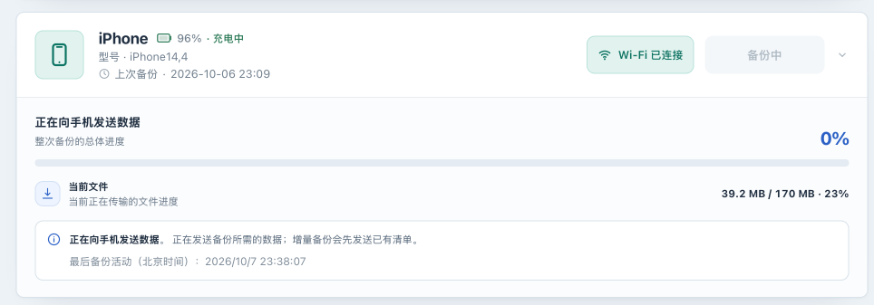

# 按症状排查问题

[English](troubleshooting.md) · [返回操作手册](../OPERATIONS.zh-CN.md)

## 目标与排查顺序

先确定失败发生在哪一步，再从不会改动数据的检查开始。保留当前备份与配对记录，在任务结束前不要连续重启组件、删除目录或重设密码。下表中的命令在 **Linux 主机的部署目录** 执行，默认 Compose 服务名 `iosbackup`、端口 `9000`；自定义项目名、文件和端口需一并替换。

先记录版本、连接方式、任务阶段、最后活动时间、手机提示和错误前后几分钟的日志。不要只截取最后一条由前面问题引发的错误。`/healthz` 成功、设备在线、进度 100% 和通知送达，分别说明不同的情况，见[状态参考](states.zh-CN.md)。

| 症状 | 先做的只读检查 | 下一步与停止条件 |
|---|---|---|
| 网页打不开 | 本机健康请求、Compose 状态、最近日志 | 本机也失败先查服务；本机成功才查主机防火墙/代理 |
| 密码不正确或反复登录 | 是否访问正确实例、管理员密码文件及 `/configs` 挂载 | 不生成新主密钥；按[安装/认证](installation.zh-CN.md)处理 |
| 升级后仍是旧版本 | `/api/version`、容器镜像引用 | 查 Compose 的 image、覆盖配置与项目名；见[升级](upgrade.zh-CN.md) |
| USB 找不到设备或配对失败 | 线缆、手机密码/信任提示、USB/udev 挂载 | 完成[USB 流程](usb-backup.zh-CN.md)，保留 lockdown |
| 手动备份不能开始 | UI 提示的离线、忙、电量/充电条件 | 先满足提示；不要绕过并发限制 |
| 自动备份没有触发 | 开关、保存状态、北京时间窗口、间隔、电量/充电 | 按[自动备份](scheduling.zh-CN.md)逐项核对，不靠频繁重启触发 |
| 等待授权或进度长期不变 | 手机锁屏/授权提示、当前阶段、最后活动 | 完成授权，区分正常准备和 `backup_stalled` |
| Wi-Fi 中断、反复重连 | 同版本 USB 对照、最早传输错误 | 先[Wi-Fi 指南](wifi.zh-CN.md)；有路由证据才看[NAT 专题](wifi-nat.zh-CN.md) |
| 信息为空、清单失败或 `MBErrorDomain/207` | 设备在线、原加密密码/主密钥、日志 | 按[加密](encryption.zh-CN.md)和[查看清单](inspection.zh-CN.md)排查，不反复改密 |
| 无空间、权限或只读错误 | 实际挂载、可用空间/inode、目录权限 | 修复明确的存储问题，不删除唯一可用备份 |
| 通知测试或真实事件未到 | 总开关、渠道开关、规则及发送结果 | 按[通知](notifications.zh-CN.md)检查；测试会发送真实消息 |

## 一、先检查服务、身份与日志

1. 在主机确认服务存在且没有反复退出。

   ```bash
   docker compose ps -a
   curl -fsS http://127.0.0.1:9000/healthz
   docker compose logs --since=10m --tail=200 iosbackup
   ```

   健康请求成功只说明 HTTP 有响应。连接被拒绝时先查启动日志、端口和监听地址；若日志报告端口占用，确认是不是旧实例仍在运行，不先杀未知进程。
2. 检查运行版本、应用状态和镜像。`curl --user iosbackup` 会提示输入管理员密码，不将密码写进命令行。

   ```bash
   curl --user iosbackup http://127.0.0.1:9000/api/version
   curl --user iosbackup http://127.0.0.1:9000/api/status
   docker inspect --format '{{.Config.Image}} {{.Image}}' iosbackup
   ```

   `/api/status` 含设备名和标识，不直接分享。`backup_in_progress_count=0` 是排查任务占用的线索，还需结合 UI 和日志确认没有其他操作。`encryption_available=true` 不等于每台设备都存有正确备份密码。
3. 本机成功但另一台电脑打不开时，核对浏览器所用主机/端口、可信网络路由和宿主机防火墙。官方部署使用 host 网络，没有额外 `ports` 映射要求。若使用 HTTPS 代理，先查本机服务，再查代理认证/TLS；不要关闭应用认证来掩盖代理配置问题。
4. 登录失败时，确认使用这个实例的默认 `admin_password` 或显式自定义密码文件，而不是手机锁屏密码或备份密码。首次日志丢失时可在宿主机用 `sudo cat data/configs/admin_password` 找回默认密码。只检查文件存在和权限，不把内容贴到终端记录或 Issue。默认文件与摘要冲突会拒绝启动，改密应另建密码文件并在配置中指定；流程见[认证操作](installation.zh-CN.md)。
5. 已有 `secrets.enc` 但缺少原密钥、密钥错误或密钥环境值与文件同时配置时，程序拒绝启动。恢复匹配的 `secret_key` 或原外部密钥，不生成新值、不删除密文。初始化报硬链接不支持时，把配置放在支持该功能的本地文件系统；原数据保留并按[实例恢复](instance-recovery.zh-CN.md)迁移。

**预期结果：** 能区分启动失败、网络入口失败、身份认证失败和版本不符。服务恢复可访问后，再处理设备问题；不要同时改动网络、存储和密码。

## 二、设备与配对

1. 使用确认能传输数据的 USB 线连接部署主机；手机出现白色密码输入界面时输入锁屏密码，出现“信任此电脑”提示时解锁后点击“信任”。无需刻意保持解锁或持续亮屏。没有弹窗时先换线/接口或重新连接，不清空所有配对记录。
2. 在主机确认 USB/udev 与持久化目录挂载，下面只显示容器侧目标和可写状态。

   ```bash
   docker inspect --format '{{range .Mounts}}{{println .Destination .RW}}{{end}}' iosbackup
   ls -ld /dev/bus/usb /run/udev
   ```

   应看到 `/dev/bus/usb`、只读 `/run/udev`、`/backups`、`/configs` 和 `/var/lib/lockdown`。若主机安装了 `lsusb`，可用它确认系统看到了 USB 设备；系统看见不等于已经配对。
3. 只在没有活动备份时刷新并配对。检查“设置 → 已移除设备”：已移除的设备不会自动回到列表，恢复到列表后原计划可能在后续检查生效，先按[设备管理](device-storage.zh-CN.md)确认计划。
4. 出现 USB mux 监听冲突时，查是否同时启动两个备份实例或主机已有相关服务。先识别旧实例和数据卷，再安排停用冲突服务；不要把整个主机的 USB 服务一并重启。
5. 如果 `lsusb` 能看到手机，应用却找不到设备，且日志出现 `Could not set configuration`、`0xfffffffa`，检查 Linux 桌面是否把手机自动挂载为相机。文件管理器中的 iPhone 相机挂载或 `gvfsd-gphoto2` 可能占用 USB 接口；`gio mount -l` 可列出相机挂载。先结束照片浏览/导入，再在文件管理器中弹出这个手机相机挂载；确认没有备份任务后，使用应用的“重启连接服务”，重新刷新并配对。弹出相机挂载不删除手机数据；不要卸载备份数据盘。此错误码只是排查线索，应先确认实际占用者。

**停止条件：** 配对/信任持续失败、卷来源不明或还有活动任务。保留 `/var/lib/lockdown` 和日志，使用[支持渠道](../../SUPPORT.md)求助。

## 三、任务未开始、停滞或失败

1. 不能开始时先读 UI 的具体原因。手动请求也可能因设备忙、充电要求或电量被拒绝；自动请求还受启用状态、北京时间窗口和最小间隔约束。手动成功不证明自动计划已经保存或到期。
2. 任务已开始时查看手机授权提示。等待密码的默认期限是 `5m`；准备/等待手机处理默认 `30m`，传输无活动默认 `10m`。这些限制约束连续无活动，不约束有持续传输的总时长。
3. 增量备份先发送旧清单，大型加密清单可能让手机准备数分钟。整体 0%、当前文件 100% 或重复进度都不能单独证明卡死；看阶段和最后活动是否更新。总体 100% 仍需等待明确成功。




4. 出现 `backup_stalled` 后，等待旧进程退出、任务资源释放，核对最后成功时间没有被本次失败更新。备份目录还在，不代表失败前其中的内容完全没有变化：增量任务可能已经写入数据，重要副本仍需独立保护。
5. 确认手机提示与连接恢复，再发起一次新任务。当前界面没有取消备份或断点续传功能；失败任务不会自动从断点接回，新的尝试可能需要重新输入手机密码。不要以加大全部超时、反复刷新或同时重启所有组件替代诊断。
6. Wi-Fi 失败时，待任务结束后用同版本、同一备份路径完成 USB 对照。USB 成功说明应进一步检查 Wi-Fi 会话；`mobilebackup2 (-4)` 本身不能唯一定位原因。跨网段连接且已有 RST/空闲复用证据时，才进入 [NAT 高级专题](wifi-nat.zh-CN.md)。

**预期结果：** 记录出错阶段、第一条错误，以及一次对比测试的结果。重复相同失败时停止连续重试，保留日志和测试结果后再求助。

## 四、备份读取与存储

1. 备份概况为空不一定表示没有文件；信息读取失败时界面仍可能显示磁盘占用。核对设备在线与原备份目录，按[只读查看](inspection.zh-CN.md)读取清单。
2. `MBErrorDomain/207` 常见于加密清单读取缺少有效密码。不要把 Web 登录密码或主密钥当作备份加密密码，也不要通过开/关加密来“修复”旧备份。保留原始密码，检查对应部署的密钥和日志，见[加密指南](encryption.zh-CN.md)。
3. 在主机查看真正保存数据的文件系统。下面路径仅适用于默认布局；自定义备份路径需替换。

   ```bash
   df -h ./data/backups ./data/configs ./data/lockdown
   df -i ./data/backups ./data/configs ./data/lockdown
   ls -ld ./data ./data/backups ./data/configs ./data/lockdown
   ```

   可用字节足够但 inode 耗尽也会失败。解包另需完整浏览副本空间；容量估计不能只看手机总容量或当前压缩比。
4. 权限/只读错误时，核对报错路径对应的挂载、属主和 NAS ACL，确认卷在当前主机可写。默认 Compose 的容器根文件系统可写；`/run/udev` 仍按只读挂载。应修复报错的数据挂载或目录权限，避免递归放宽整个目录树的权限。不要在运行中的备份目录上做试探性写入。

**停止条件：** I/O 错误、目录意外消失、数据格式不明或只剩唯一有效副本。先保护数据，再按[实例恢复](instance-recovery.zh-CN.md)制定恢复方案；不要先运行删除/恢复实验。

## 五、准备一个可用且脱敏的求助记录

1. 记录 `/api/version` 的版本和 commit、主机/NAS 型号与架构、iOS 版本、USB/Wi-Fi、是否加密及复现步骤。
2. 保存期望结果、实际阶段、手机提示、第一次错误与操作时间；用户可见时间为北京时间。日志只截故障前后必要窗口，保留顺序及错误码。
3. 删除完整设备标识、设备名、网络地址、个人路径、通知目标/token、密码和主密钥。不要上传凭据配置文件、`secret_key`、`admin_password`、配对记录、`secrets.enc`、备份内容、原始抓包或完整容器环境。首次初始化日志也可能含生成的管理员密码，分享前必须逐行核对。
4. 普通问题按 [SUPPORT](../../SUPPORT.md) 提交；安全敏感问题按 [SECURITY](../../SECURITY.md) 使用私密渠道。不要为求助再次触发破坏性操作。

下一步：恢复服务后按[USB 验证](usb-backup.zh-CN.md)确认 USB 备份可用，再逐项恢复计划和通知，记录哪些功能仍未验证。
