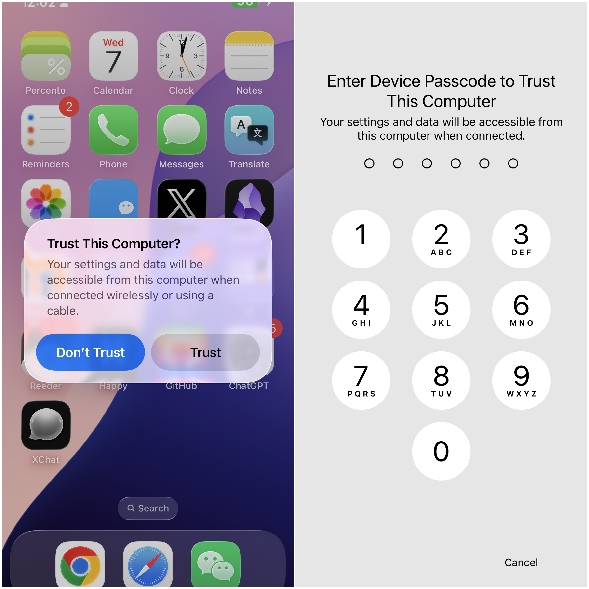
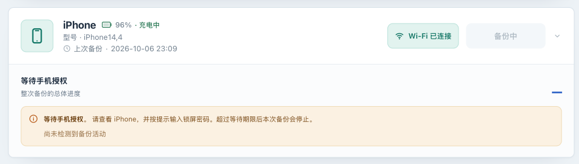

# Pair your first device and complete a USB backup

[简体中文](usb-backup.zh-CN.md) · [Back to the operations manual](../OPERATIONS.md)

## Goal and conditions

Pair the phone with this instance, complete one USB backup, and record the backup result and completion time. This guide assumes a working installation following this manual and an iPhone/iPad you are authorized to back up and can unlock. Test USB first; you can also retry over USB if Wi-Fi backup fails.

Read [the scope](overview.md) first. There is no “back up a few test files” mode; a first attempt may copy substantial personal data. Prefer a non-critical device and retain existing independent backups.

## 1. Prepare the phone, storage, and device settings

1. **On the phone** , confirm that you know its passcode and can respond to prompts. Use a data-capable USB cable; a charging-only cable cannot pair. Apple explains that trust permits access to device data and that later backups may prompt again; see [the Trust This Computer alert](https://support.apple.com/en-ie/109054).
2. **At the Linux/NAS host** , confirm it runs the container and exposes its USB devices. Connect the phone to this host, not merely to the computer displaying the Web UI.
3. **In the host deployment directory** , check storage and inodes:

   ```bash
   df -h data/backups
   df -i data/backups
   ```

   Compare with used capacity under **Settings → General → iPhone Storage** (or iPad Storage). Leave headroom and space for the host. Actual backup size differs; a ready device does not prove adequate disk capacity.
4. **In the Web UI** , leave **Automatic backup** off before the first run and do not start unpack, delete, or restore jobs. New devices default to **20%** minimum battery and **Only back up while charging** . Manual **Back up now** also obeys both settings. Check that the UI actually shows **Charging** after USB connection; a connected cable alone does not establish charging status.
5. If backup encryption was already enabled on the device, confirm that its original backup password is safely retained. Neither this instance's administrator password nor its master key replaces it. Keep the existing encryption state for the first run; see [Encryption and passwords](encryption.md).

## 2. Pair over USB with this instance

1. **In the browser** , sign in and open **First-use guide** from the menu. On the Wi-Fi preparation page, choose **Skip for now — use USB** .
2. Connect the phone to the Linux/NAS host with a data cable. If a white passcode screen appears, enter the device passcode; there is no need to unlock it in advance or keep the screen on. If several devices are present, check the name and model and choose the intended one.
3. **In the Web UI** , wait for the connection step to identify the device. If needed, use **Refresh devices** while no job is active. Confirm **USB** , rather than merely a Wi-Fi presence.
4. **On the phone** , unlock it and select **Trust** when asked, then enter the **device passcode** as requested. Trusting another Mac/Windows computer does not establish trust with this NAS.
5. **In the Web UI** , select **I confirmed — check pairing** in the guide. Respond to any new phone prompt, then wait for **Pairing complete** and **Complete the first backup** . A device that already trusts this instance may pass without a new prompt.




Pairing records live in `data/lockdown` under the deployment directory, mounted as `/var/lib/lockdown`. Later backups need not recreate pairing each time, but the device may still request authorization for the current backup. Preserve this directory; deleting pairing records is not the first troubleshooting step.

## 3. Start the backup and authorize it on the phone

1. **In the Web UI** , confirm the device is online, paired, connected by USB, and meets its battery/charging conditions. Ensure **Save location** is inside persistent `/backups`. The default `/backups` maps to host `data/backups`; individual device data normally lives in its UDID subdirectory.
2. Select **Back up now** once in the guide or device card. Do not repeatedly click or restart the connection service while the job starts.
3. **On the phone** , enter the device passcode if a white passcode screen appears when the backup wakes it. If a trust prompt appears, unlock the phone and tap **Trust** . After authorization, there is no need to keep the phone unlocked or its screen on. Pairing does not eliminate backup authorization. The default authorization wait is 5 minutes; after timeout, resolve the cause and start a new job.
4. **In the Web UI** , return from the guide to the console for detailed progress. Keep USB connected and the host running until the page shows that the backup has completed, failed, or been interrupted.

Live-update controls only affect page refresh. Pausing updates or closing the browser does not cancel a background backup. There is currently no user-facing **Cancel backup** button. Do not unplug the cable to simulate cancellation. If maintenance requires interruption, consult [troubleshooting](troubleshooting.md), record the current state and check which data an interruption could affect first.

## 4. Interpret progress and wait for completion

| Display | Meaning and action |
|---|---|
| **Preparing the backup session** | Measurable overall progress is not available yet; watch the phone for authorization. |
| **Waiting for device authorization** | Act on the phone, not in the Web login form. Confirm and continue observing. |
| **Sending data to the device** | The host may send an existing manifest or other required data. Incremental jobs may send before receiving. |
| **Waiting for the device** | The phone may scan or prepare its manifest. Large encrypted backups can take several minutes without percentage changes. Check last activity rather than only 0%. |
| **Backup in progress** and current-file progress | Overall progress describes the job; file progress describes one file. Resetting file progress on the next file does not restart the entire backup. |
| Overall progress only | Reliable file byte counts were unavailable; omitting file progress is expected. |
| 100% while still running | Transfer percentage does not establish successful tool exit. Wait for protocol handling and finalization; keep the cable connected; the backup is not yet complete. |
| **Backup completed** | The job ended successfully; check completion time and the latest backup record next. |
| **Backup failed** or **Backup interrupted** | This job has ended. Record messages and logs, fix the cause, then start a new job. |

Phases can repeat or alternate; they are not a checklist that must appear in order. Default inactivity limits are 30 minutes during preparation/device processing and 10 minutes while sending or receiving, with a separate 5-minute authorization wait. They are not a total-job duration limit. Do not increase timeouts to conceal missing authorization, disconnection, or storage problems. See the [configuration reference](configuration.md).




Examples of the authorization-wait and completed-backup states. These captures show a Wi-Fi connection; when validating a USB backup in this section, confirm that the device shows USB.

## 5. Verify and record the first result

1. **In the Web UI** , wait for **Backup completed** , or **First backup complete** in the guide. Check completion time, **Last backup** , and that the backup button is available again. Displayed times use Beijing time (UTC+8).
2. **In the host deployment directory** , inspect the job logs:

   ```bash
   docker compose logs --tail=200 iosbackup
   ```

   Match the device and current job; do not mistake an earlier success for this one. Redact UDIDs, IPs, device names, and paths before sharing. Two hundred lines may not cover a long first backup; retain the relevant time range.
3. **With the device still online and no job active** , open **Backups** and select **Refresh** in **Backup overview** to try reading information and the file list. Large backups can take time. Record that result separately; see [Inspect backups](inspection.md) for steps and limits.
4. Record application version/commit, device model and OS, USB connection, completion time, encryption state, and whether the manifest is readable. Arrange [an instance copy](instance-recovery.md) so this does not become your only usable copy.


Keep these results separate:

| Evidence | What it establishes | What it does not establish |
|---|---|---|
| The page shows backup completed | The backup tool reported success and exited normally, and the application recorded completion | The application did not thereby automatically verify every file or perform device restoration |
| Readable information or file list | This request worked with the current path, online device, and any required password | A list or CSV is not a copy of backup data and does not prove every file is intact |
| Required metadata and a valid completion marker | Additional inspection found expected structure and a completion marker | Structural checks do not replace content validation or a restore exercise |
| Restoration on an isolated device | Restoration worked under recorded device/version/conditions | It is not a guarantee for all devices and backup versions; there is no record of a successful full-device restore using this manual yet |


## Failure paths

| Symptom | Lowest-impact check | Next step and stop condition |
|---|---|---|
| No device or Trust prompt | Reconnect, try a reliable data cable/USB port, confirm connection to the service host, and respond to passcode or trust prompts | Check USB/udev mounts and logs. Rule out the physical connection first; do not begin by resetting phone networking or deleting pairing state. |
| Pairing repeatedly fails | Read phone and guide errors; confirm the correct device | With no active job, retry **Check pairing again** . For persistent failures, use [troubleshooting](troubleshooting.md). Apple's trust reset affects existing trust relationships; use its official procedure only when clearly needed. |
| **Back up now** is rejected | Check charging, low battery, offline, or busy messages | Meet the named condition and wait for existing jobs before retrying. Manual backups do not bypass charging/battery checks. |
| Authorization wait fails | Confirm that this job's phone prompt appeared and was answered | After the job ends, start again and respond to any new authorization prompt on the phone; do not repeatedly submit during the old job. |
| Long 0% or unchanged progress | Inspect phase, last activity, and container logs | Device processing may require waiting. Retain logs after an inactivity timeout. If USB also fails, fix storage, authorization, and communication before switching to Wi-Fi. |
| No space or permission error | Check target-volume capacity, inodes, mounts, and write access | Resolve the resource issue before retrying; do not delete the only known usable backup for space. |
| Job succeeds but information/list fails | Confirm the device is online and whether backup encryption was already enabled | Errors such as `MBErrorDomain/207` can involve a missing password. Preserve the success record and backup, then use [the password guide](encryption.md). Record job success and read failure separately. |

**Back up again** starts a new job. It may use an existing backup set incrementally, but **it does not resume the old protocol session and there is no manual checkpoint-resume operation** . Retry only after the job has ended and the problem has been resolved.

## Next steps

After USB success, preserve [a complete instance copy](instance-recovery.md), then configure [automatic backups](scheduling.md). For wireless use, separately validate a [manual Wi-Fi backup](wifi.md). Device presence alone is insufficient to enable a long-term schedule confidently.
