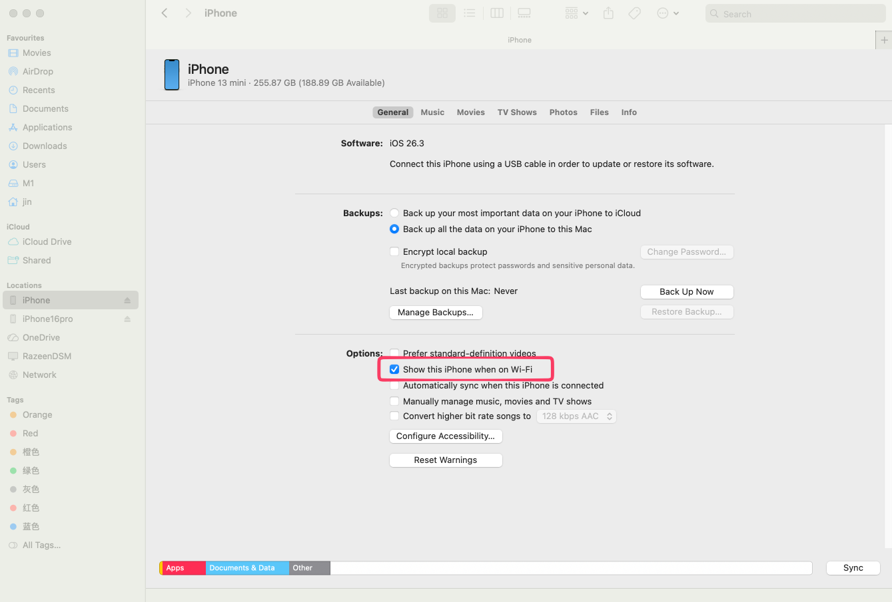
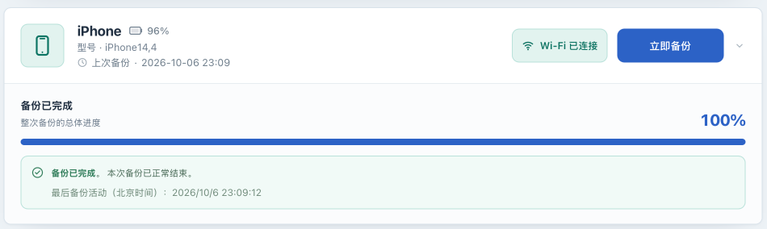

# Enable and validate Wi-Fi backup

[简体中文](wifi.zh-CN.md) · [Back to the operations manual](../OPERATIONS.md)

## Goal and requirements

Complete a real Wi-Fi backup on a device already paired and backed up over USB, then decide whether to use that connection for its routine schedule. Wi-Fi is **Core** functionality. The device OS, screen lock, and network equipment can affect the result. One successful run does not establish unattended operation across all devices and networks.

These instructions assume a Linux container and a phone on the same LAN, with network access between them. The Mac/Windows steps below only prepare the phone's wireless connection setting; they do not establish native runtime support for this project on those systems.

## Before you begin

- Complete [USB pairing and backup](usb-backup.md) in this deployment and persist `/var/lib/lockdown`.
- Put the device and NAS/Linux host on a mutually reachable network. The host can use Ethernet while the device uses Wi-Fi. For the first validation, avoid guest networks, client isolation, and routing between subnets.
- Keep the official Compose host-network configuration, with a writable backup location and enough space.
- Temporarily turn off this device's automatic backup and save. Ensure all Wi-Fi jobs have finished before changing wireless connection settings or a manual IP address.
- Keep the default `netmuxd` backend and `IOSBK_WIFI_POWER_ASSERTION=true`. The power helper cannot guarantee an uninterrupted transfer; neither setting needs changing for first validation.

## Prepare wireless connectivity on a computer

1. **On a Mac or Windows computer** , connect the device over USB and enter its passcode when prompted, or unlock it and tap **Trust** . Pairing with this computer does not replace pairing with the NAS.
2. Follow the applicable route:

   | Computer application | Location and action |
   |---|---|
   | Mac Finder | Select the device in the sidebar, open General, enable **Show this [device] when on Wi-Fi** , and apply the change. See [Apple's Finder Wi-Fi guide](https://support.apple.com/guide/mac-help/mchlada1d602/mac). |
   | Windows Apple Devices | Select the device in the sidebar, open General, enable **Show this [device] when on Wi-Fi** , and apply the change. See [Apple's Apple Devices guide](https://support.apple.com/guide/devices-windows/sync-content-over-wi-fi-mchl388b22c3/windows). |
   | Windows computer still using iTunes | Open the device Summary, enable **Sync with this [device] over Wi-Fi** in Options, and apply the change. See [Apple's iTunes guide](https://support.apple.com/en-gb/guide/itunes/itns3751d862/windows). |

3. Confirm the setting was applied, then disconnect the computer's data cable. If the application has no corresponding option, check software and device state using its Apple guide and continue with USB. Selecting “I have completed this” in the NAS onboarding guide does not prove the computer-side setting was applied.

These computer-side routes were checked against official Apple documentation on 2026-10-06. Labels can vary by language and software version. You do not need to change music, photo, or other content-sync selections for this project.

## Complete one Wi-Fi backup on the NAS

1. **In the Web UI** , confirm this deployment has paired with the device and completed a USB backup. Otherwise, return to [USB backup](usb-backup.md).
2. **On the phone** , join a Wi-Fi network that can reach the host and connect a charger. Do not leave a USB data cable connected to the NAS: the application prefers USB when it is available.
3. **In the Web UI** , wait for discovery to update. With no job running, you can select **Refresh devices** from the upper-right menu. Confirm the target card shows **Wi-Fi connected** .
4. Open **Backup settings** . Leave **Device IP** blank when local-network discovery works. If a manual address is necessary, complete the next section and return here.
5. Check the minimum battery, charging requirement, and save location, then select **Back up now** . **On the phone** , enter the device passcode if a white passcode screen appears when the backup wakes it, or unlock it and tap **Trust** if prompted. Maintain Wi-Fi and power throughout the job; keeping the phone unlocked or its screen on is not required.
6. Wait for an explicit success or failure state. On success, check the completion time, then try reading information and the list under [View backups](inspection.md). Record whether an encrypted list was actually readable.

## Use a known device IP when discovery fails

A manual IP helps connect an already paired, reachable device. It does not bypass a firewall or supply missing trust or wireless preparation. The test attempts a device connection; it is not merely a latency display.

1. **On the phone or router management page** , identify this device's current IP. Do not guess, use the NAS address, or enter a hostname or a URL with a port.
2. Ensure no Wi-Fi job is active. **In Web UI → Backup settings** , enter **Device IP** and select **Test connection** .
3. Wait for **Device connected. Save settings to keep this IP.** , then select **Save settings** and confirm the save. A successful test alone does not persist the address from the input field.
4. Confirm the card shows Wi-Fi and run the complete manual backup above. Recheck, test, and save if the address changes. Updating or clearing an existing saved address can restart the wireless connection service, so do it only while idle.

If the known IP still does not establish a connection, stop repeating the test and check for pending passcode or trust prompts, pairing, and the network path. Extra routing, VPN, or NAT configuration is outside this page's generally validated setup route.

## Failure branches and USB fallback

| Symptom | Next action |
|---|---|
| Card keeps showing USB | Ensure no job is running, disconnect the data cable to the NAS, and wait for Wi-Fi before repeating validation |
| Device is missing | Check the computer-side setting, phone Wi-Fi, pairing with this deployment, and network isolation. Do not start by deleting lockdown records |
| IP is reachable but the device stays offline | Respond to passcode or trust prompts and check wireless preparation; network reachability does not establish backup-service availability |
| Waiting for authorization | Respond on the phone. If authorization times out, wait for the old job to finish before starting another |
| Brief disappearance or “Waiting for the device to reconnect” | Observe the job phase and last activity. An online device does not mean backup data is still being transferred |
| Failure, `mobilebackup2 (-4)`, or `backup_stalled` | Preserve surrounding logs and phase information, wait for the job to end, then make the USB comparison below |

1. Turn automatic backup off and save, then wait for the old job's failed, interrupted, or completed state. There is no cancel button in the current version; do not repeatedly restart connection services during an active job.
2. Connect the NAS with a reliable USB data cable, respond to passcode or trust prompts, and wait for **USB connected** .
3. Confirm the same save location and backup set, then start a new manual backup. It is a new job that may incrementally update the existing set, not a resumption of the failed Wi-Fi session.
4. If USB succeeds but Wi-Fi repeatedly fails, use USB for now. Follow [Troubleshooting](troubleshooting.md); consult the [Wi-Fi NAT case study](wifi-nat.md) only when logs and connection checks point to a problem with an idle connection between subnets. Do not copy firewall rules for a different router without analysis.

## Next steps

After at least one real Wi-Fi job succeeds, configure [automatic backup](scheduling.md). Revalidate after device OS or network changes, and keep USB fallback available. See [State reference](states.md) and [Configuration reference](configuration.md) for timeout and disconnect-grace behavior.
